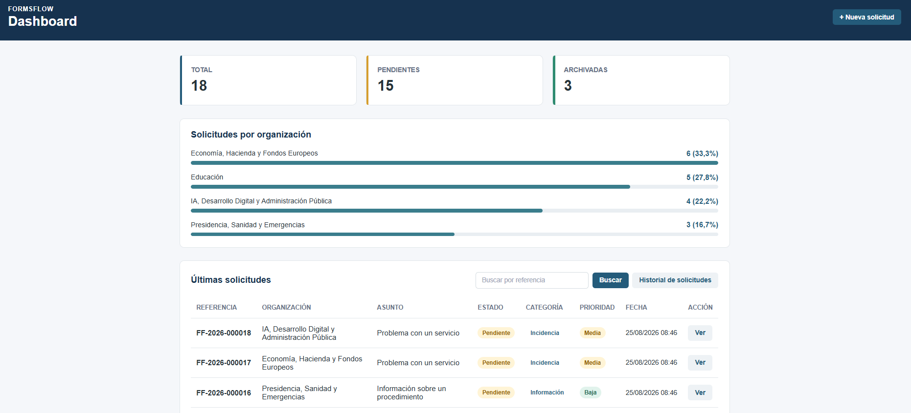
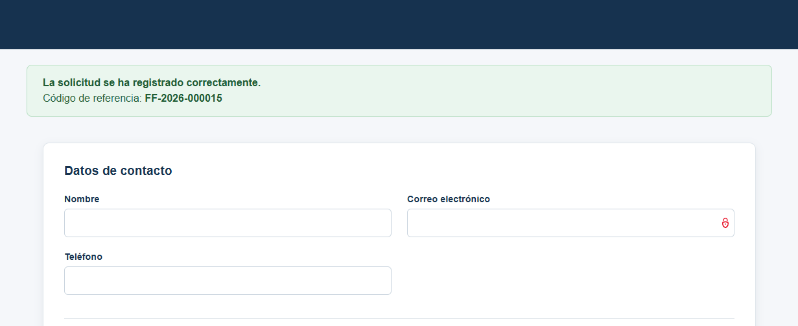
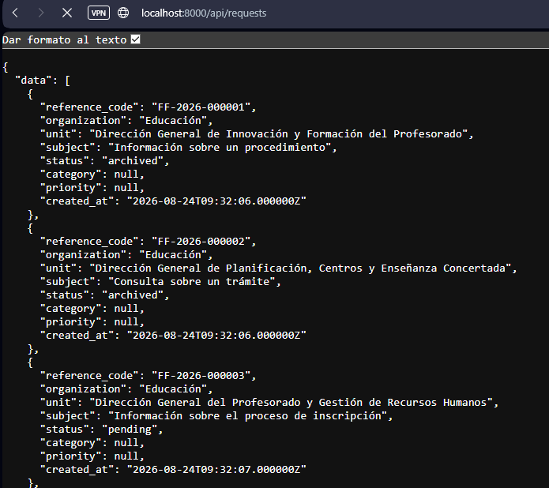
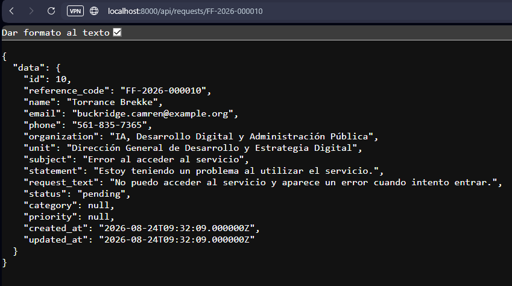
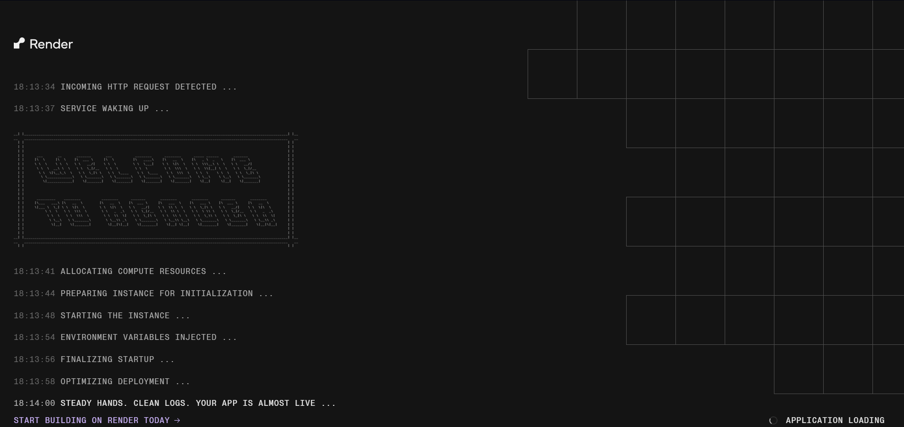

# FormsFlow - Gestión de solicitudes

**Aplicación web full-stack para la gestión de solicitudes, integración de datos, API REST y automatización de procesos.**

FormsFlow es un proyecto full-stack desarrollado con Laravel que reproduce, a pequeña escala, un flujo de trabajo de gestión digital de solicitudes:



Flujo de la aplicación:

```text
┌──────────────┐
│  Formulario  │
└──────┬───────┘
       │
       ▼
┌──────────────┐
│   API REST   │
└──────┬───────┘
       │
       ▼
┌──────────────┐
│ Base de datos│
└──────┬───────┘
       │
       ▼
┌──────────────┐
│     ETL      │
└──────┬───────┘
       │
       ▼
┌──────────────┐
│ Explotación  │
│     dato     │
└──────┬───────┘
       │
       ▼
┌──────────────┐
│Automatización│
└──────┬───────┘
       │
       ▼
┌──────────────┐
│ Clasificación│
│     NLP      │
└──────────────┘
```

## Índice

- [Descripción](#descripción)
- [Objetivos](#objetivos)
- [Caso de uso](#caso-de-uso)

- [Modelo de datos](#modelo-de-datos)
  - [Datos principales de una solicitud](#datos-principales-de-una-solicitud)
  - [Tipos de solicitudes](#tipos-de-solicitudes)

- [Arquitectura](#arquitectura)

- [Stack tecnológico](#stack-tecnológico)
  - [Backend](#backend)
  - [Frontend](#frontend)
  - [Base de datos](#base-de-datos)
  - [API](#api)
  - [Procesamiento de datos](#procesamiento-de-datos)
  - [NLP](#nlp)
  - [Pruebas](#pruebas)
  - [Contenedores y desarrollo](#contenedores-y-desarrollo)

- [Docker](#docker)

- [API REST](#api-rest)
  - [Endpoints](#endpoints)
  - [Listar solicitudes](#listar-solicitudes)
  - [Crear una solicitud](#crear-una-solicitud)
  - [Obtener una solicitud](#obtener-una-solicitud)
  - [Archivar una solicitud](#archivar-una-solicitud)
  - [Validación](#validación)
  - [Códigos HTTP utilizados](#códigos-http-utilizados)

- [ETL y procesamiento NLP](#etl-y-procesamiento-nlp)
  - [Clasificación NLP](#clasificación-nlp)
  - [Funcionamiento](#funcionamiento)

- [Automatización](#automatización)
  - [Ejecución manual](#ejecución-manual)
  - [Ejecución al recibir una solicitud](#ejecución-al-recibir-una-solicitud)
  - [Generación automática de informes](#generación-automática-de-informes)
  - [Ejecución periódica](#ejecución-periódica)

- [Dashboard y explotación del dato](#dashboard-y-explotación-del-dato)
  - [Paginación](#paginación)
  - [Búsqueda](#búsqueda)
  - [Estadísticas por organización](#estadísticas-por-organización)
  - [Estados de las solicitudes](#estados-de-las-solicitudes)
  - [Consulta del detalle](#consulta-del-detalle)
  - [Clasificación y explotación](#clasificación-y-explotación)
  - [Generación de informe](#generación-de-informe)

- [Testing](#testing)
  - [Pruebas del clasificador NLP](#pruebas-del-clasificador-nlp)
  - [Pruebas de la API](#pruebas-de-la-api)

- [Instalación](#instalación)
  - [Requisitos](#requisitos)
  - [Ejecutar el proyecto](#ejecutar-el-proyecto)
  - [Datos de demostración](#datos-de-demostración)
  - [Generación de recursos frontend](#generación-de-recursos-frontend)

- [Estructura del proyecto](#estructura-del-proyecto)

- [Decisiones técnicas](#decisiones-técnicas)
  - [Laravel como framework principal](#laravel-como-framework-principal)
  - [Separación entre solicitudes recibidas y solicitudes procesadas](#separación-entre-solicitudes-recibidas-y-solicitudes-procesadas)
  - [Servicio independiente para el ETL](#servicio-independiente-para-el-etl)
  - [Servicio independiente para el NLP](#servicio-independiente-para-el-nlp)
  - [NLP basado en reglas](#nlp-basado-en-reglas)
  - [Docker desde el inicio](#docker-desde-el-inicio)
  - [Datos de demostración](#datos-de-demostración)
  - [Alcance controlado](#alcance-controlado)

- [Mejoras futuras](#mejoras-futuras)
  - [Historial avanzado de solicitudes](#historial-avanzado-de-solicitudes)
  - [Gestión de solicitudes desde el Dashboard](#gestión-de-solicitudes-desde-el-dashboard)
  - [Autenticación y autorización](#autenticación-y-autorización)
  - [Exportación de información](#exportación-de-información)
  - [Documentación avanzada de la API](#documentación-avanzada-de-la-api)
  - [NLP avanzado](#nlp-avanzado)
  - [Dashboard avanzado](#dashboard-avanzado)
  - [Automatización avanzada](#automatización-avanzada)
  - [Monitorización y observabilidad](#monitorización-y-observabilidad)
  - [Escalabilidad del procesamiento](#escalabilidad-del-procesamiento)

- [Documentación](#documentación)

- [Despliegue](#despliegue)
  - [Entorno de demostración](#entorno-de-demostración)
  - [Automatización en producción](#automatización-en-producción)

- [Enlaces](#enlaces)

- [Condiciones de uso](#condiciones-de-uso)

---
## Descripción

FormsFlow es una **aplicación web full-stack** desarrollada con Laravel que reproduce, a pequeña escala, un **flujo de gestión digital de solicitudes**.

El proyecto integra en una misma aplicación diferentes capacidades relacionadas con el **desarrollo de soluciones digitales**:

- Formularios digitales y validación de datos.
- Persistencia en una base de datos relacional.
- API REST para la integración con otros sistemas.
- Procesamiento ETL de la información.
- Clasificación automática mediante técnicas de PLN basadas en reglas y palabras clave ponderadas.
- Automatización de procesos mediante Jobs y Laravel Scheduler.
- Explotación del dato mediante informes y un Dashboard.
- Testing automatizado.
- Contenerización mediante Docker.

FormsFlow utiliza un caso de uso ficticio inspirado en procesos habituales de gestión de solicitudes administrativas electrónicas. **No utiliza datos personales** reales ni tramita solicitudes reales.

El **objetivo** no es construir una plataforma administrativa completa, sino desarrollar una aplicación demostradora que permita mostrar de forma integrada diferentes competencias de desarrollo, integración, tratamiento de datos, automatización y aplicación de técnicas de PLN.

---

[ÍNDICE](#índice)

## Objetivos

El objetivo principal de FormsFlow es demostrar el desarrollo de una **solución digital completa** que cubra el ciclo básico de recepción, procesamiento y explotación de una solicitud:

```text
Formulario
    ↓
Validación
    ↓
Persistencia
    ↓
┌──────────────────────┐
│                      │
│ API REST              │
│        +              │
│ ETL + Clasificación   │
│ NLP                   │
│                      │
└──────────┬───────────┘
           ↓
    Datos procesados
           ↓
   Explotación del dato
           ↓
      Automatización
```

La aplicación también incorpora un mecanismo de **procesamiento automático** que permite desencadenar el procesamiento de una nueva solicitud mediante un ``Job``, manteniendo además la posibilidad de ejecutar el proceso de forma periódica mediante Laravel Scheduler.

---
[ÍNDICE](#índice)
## Caso de uso

FormsFlow **simula una plataforma de gestión de solicitudes** dirigidas a diferentes organismos y unidades administrativas.

El **usuario puede presentar una solicitud** mediante un formulario digital indicando sus datos de contacto, el organismo y unidad destinataria, el asunto, la exposición de la situación y la actuación solicitada. Una vez registrada, la solicitud queda almacenada en la base de datos y puede ser **consultada mediante la aplicación y su API REST**.


Una vez pulsado el botón enviar, se muestra el número de referencia asignado a la solicitud.



Una vez registrada una nueva solicitud, se puede desencadenar automáticamente el proceso de procesamiento mediante ``ProcessApplicationRequestsJob``.

El **pipeline ETL** extrae las solicitudes almacenadas, transforma y normaliza su información y genera registros preparados para su explotación. Durante este procesamiento se aplica un componente de **PLN basado en reglas y palabras clave ponderadas**. En función del contenido de la solicitud, el clasificador asigna una categoría y una prioridad orientativa a cada solicitud.

Los datos procesados se almacenan en ``ProcessedRequest`` y se utilizan posteriormente para **generar informes** estadísticos y alimentar el Dashboard de FormsFlow. El proceso de generación de informes se ejecuta mediante GenerateRequestReportJob después del procesamiento ETL.

---
[ÍNDICE](#índice)
## Modelo de datos

FormsFlow utiliza un **modelo relacional** para separar las solicitudes recibidas de los registros generados durante su procesamiento.

La información principal se organiza alrededor de dos entidades:

- `application_requests`: almacena las solicitudes originales recibidas por la aplicación.
- `processed_requests`: almacena la información transformada y clasificada durante el proceso ETL.

Esta separación permite diferenciar entre los **datos de entrada** y los **datos preparados** para su explotación, manteniendo separadas las responsabilidades de recepción y procesamiento.

### Datos principales de una solicitud

Una solicitud contiene información relacionada con diferentes aspectos del proceso:

```text
Solicitud
│
├── Identificación
│   └── Referencia
│
├── Persona solicitante
│   ├── Nombre
│   └── Datos de contacto
│
├── Destino
│   ├── Organización
│   └── Unidad
│
├── Contenido
│   ├── Asunto
│   ├── Exposición
│   └── Texto de la solicitud
│
├── Gestión
│   └── Estado
│
├── Clasificación
│   ├── Categoría
│   └── Prioridad
│
└── Fechas
    ├── Creación
    └── Procesamiento
```

Los datos de clasificación (`category` y `priority`) se generan durante el procesamiento mediante el componente de PLN y permiten utilizar posteriormente la información para consultas, estadísticas, explotación del dato e informes.

### Tipos de solicitudes

El componente de PLN clasifica las solicitudes en tres categorías principales:

* `informacion`: consultas o solicitudes de información.
* `incidencia`: problemas o errores relacionados con un servicio o procedimiento.
* `documentacion`: solicitudes relacionadas con documentos, certificados o justificantes.

La prioridad se clasifica en tres niveles:

* `baja`
* `media`
* `alta`

La clasificación se realiza mediante un sistema de reglas y términos ponderados implementado en el servicio `RequestNLPClassifier`.

---
[ÍNDICE](#índice)
## Arquitectura

FormsFlow sigue una **arquitectura basada en Laravel** en la que los diferentes componentes de la aplicación se organizan según su responsabilidad.

```text
┌──────────────────────────────┐
│            Usuario           │
└──────────────┬───────────────┘
               │
               ▼
┌──────────────────────────────┐
│      Formularios / Blade     │
└──────────────┬───────────────┘
               │
               ▼
┌──────────────────────────────┐
│         Controllers          │
│   Web / API REST / Dashboard │
└──────────────┬───────────────┘
               │
               ▼
┌──────────────────────────────┐
│           Eloquent           │
│        Modelos y ORM         │
└──────────────┬───────────────┘
               │
               ▼
┌──────────────────────────────┐
│        Base de datos         │
└──────────────┬───────────────┘
               │
               │
               ▼
┌──────────────────────────────┐
│   ProcessApplicationRequests │
│             Job              │
└──────────────┬───────────────┘
               │
               ▼
┌──────────────────────────────┐
│      RequestETLService       │
│   Extract → Transform → Load │
└──────────────┬───────────────┘
               │
               ├───────────────► RequestNLPClassifier
               │                         │
               │                         ▼
               │                  Categoría / Prioridad
               │
               ▼
┌──────────────────────────────┐
│      ProcessedRequest        │
└──────────────┬───────────────┘
               │
               ├───────────────► Dashboard
               │
               ▼
┌──────────────────────────────┐
│   GenerateRequestReportJob   │
└──────────────┬───────────────┘
               │
               ▼
┌──────────────────────────────┐
│        RequestReport         │
│       Informes estadísticos  │
└──────────────────────────────┘
```

La aplicación utiliza Laravel como núcleo de la solución y separa las responsabilidades principales entre:

* **Controladores:** gestionan las peticiones web, la API REST y el Dashboard.
* **Modelos:** representan las entidades y gestionan la persistencia mediante Eloquent.
* **Servicios:** encapsulan la lógica de procesamiento ETL y clasificación NLP.
* **Jobs:** permiten ejecutar el procesamiento y la generación de informes de forma automatizada.
* **Comandos Artisan:** proporcionan puntos de entrada para tareas de procesamiento y mantenimiento.
* **Vistas Blade:** presentan los formularios y la información del Dashboard.
* **Pruebas:** verifican el comportamiento de componentes principales de la aplicación.

El procesamiento ETL se encapsula en `RequestETLService`, mientras que la clasificación de las solicitudes se concentra en `RequestNLPClassifier`.

`ProcessApplicationRequestsJob` coordina el procesamiento de las solicitudes y, una vez finalizado el ETL, desencadena `GenerateRequestReportJob` para generar el informe correspondiente.

Esta **separación de responsabilidades** mantiene aislada la lógica de procesamiento de la capa de presentación y facilita su mantenimiento, reutilización y prueba.

---
[ÍNDICE](#índice)
## Stack tecnológico

### Backend

- **PHP**
- **Laravel**
- **Eloquent ORM**
- **Artisan**

Laravel proporciona la estructura principal de la aplicación, incluyendo routing, controladores, validación, ORM, comandos de consola, Jobs y Scheduler.

### Frontend

- **Blade**
- **HTML**
- **CSS / SCSS**
- **JavaScript**
- **Vite**

Blade se utiliza para construir las interfaces de la aplicación y Vite para gestionar y generar los recursos frontend tanto en desarrollo como en producción.

### Base de datos

FormsFlow utiliza **PostgreSQL** como sistema gestor de base de datos relacional.

La estructura de la base de datos se define mediante **migraciones de Laravel**, mientras que el acceso a los datos se realiza principalmente mediante **Eloquent ORM**.

Cuando resulta necesario realizar operaciones agregadas o consultas específicas se utilizan consultas SQL mediante las capacidades de Laravel para ello.

### API

La aplicación dispone de una **API REST** para la gestión de solicitudes.

La API permite, entre otras operaciones:

- Consultar solicitudes.
- Crear solicitudes.
- Consultar una solicitud concreta.
- Archivar solicitudes.

Las operaciones están validadas y disponen de pruebas funcionales automatizadas en `tests/Feature/ApplicationRequestApiTest.php`.

La estrategia de testing y el resultado de las pruebas se describen en la sección [Testing](#testing).

### Procesamiento de datos

El procesamiento se realiza mediante un pipeline **ETL** implementado dentro de Laravel:

```text
Extract
   ↓
Transform
   ↓
Load
```

Durante la fase de transformación se normaliza la información y se aplica el clasificador NLP.

El proceso está encapsulado en `RequestETLService` y puede ejecutarse mediante `ProcessApplicationRequestsJob`.

### NLP

El componente de NLP está implementado actualmente como un servicio PHP:

```text
App\Services\RequestNLPClassifier
```

El sistema normaliza el texto y utiliza reglas y términos ponderados para determinar la categoría y prioridad orientativa de una solicitud.

No se utiliza actualmente un modelo de aprendizaje automático entrenado. El enfoque se ha elegido por su sencillez, trazabilidad y adecuación al alcance del proyecto demostrador.

### Pruebas

El proyecto utiliza:

* **PHPUnit / Laravel Testing**
* **Tests unitarios**
* **Tests funcionales de API**

Las pruebas cubren, entre otros aspectos, el comportamiento del clasificador NLP y las operaciones principales de la API REST.

### Contenedores y desarrollo

El entorno de desarrollo utiliza:

* **Docker**
* **Docker Compose**
* **Composer**
* **npm**
* **Vite**

El objetivo de Docker es proporcionar un entorno reproducible para ejecutar la aplicación y sus servicios asociados.

La configuración incluye un contenedor para la aplicación Laravel y un servicio PostgreSQL, permitiendo levantar el entorno de desarrollo de forma aislada mediante Docker Compose.

---
[ÍNDICE](#índice)

## Docker

FormsFlow utiliza **Docker** para proporcionar un entorno de desarrollo reproducible y aislado.

Docker Compose permite **levantar los servicios necesarios** para ejecutar la aplicación sin depender de una configuración manual específica del sistema operativo.

El proyecto utiliza Docker principalmente para el entorno de ejecución de Laravel y PostgreSQL.

La configuración se define en `compose.yaml` e incluye:

- **`app`**: contenedor de la aplicación Laravel.
- **`db`**: contenedor PostgreSQL.
- **Volumen persistente** para los datos de PostgreSQL.
- **Healthcheck** para comprobar la disponibilidad de la base de datos antes de iniciar la aplicación.

Los principales comandos utilizados durante el desarrollo son:

Para construir e iniciar los servicios en segundo plano:

```bash
docker compose up -d
```

Para consultar el estado de los contenedores:

```bash
docker compose ps
```

Para acceder al contenedor de la aplicación:

```bash
docker compose exec app sh
```

Para ejecutar comandos Artisan dentro del contenedor:

```bash
docker compose exec app php artisan <comando>
```

Por ejemplo, para ejecutar la suite de pruebas:

```bash
docker compose exec app php artisan test
```

También se pueden ejecutar comandos de Laravel Tinker para comprobar directamente el estado de los datos:

```bash
docker compose exec app php artisan tinker
```

El entorno Docker se utiliza durante el desarrollo para mantener consistente la configuración de PHP, Laravel y PostgreSQL, y permite ejecutar la aplicación y sus herramientas asociadas sin instalar estos servicios directamente en el sistema operativo.

---
[ÍNDICE](#índice)

## API REST

FormsFlow dispone de una **API REST desarrollada con Laravel** que permite consultar, crear y gestionar solicitudes de forma programática.

La API proporciona una interfaz de integración independiente de la interfaz web, permitiendo que otros sistemas o clientes puedan interactuar con las solicitudes mediante peticiones HTTP y respuestas en formato JSON.

### Endpoints

La API implementa actualmente cuatro operaciones principales:

| Método | Endpoint | Descripción | Respuesta |
|---|---|---|---|
| `GET` | `/api/requests` | **Obtiene un listado** resumido de solicitudes | `200 OK` |
| `POST` | `/api/requests` | Crea una **nueva solicitud** | `200 OK` |
| `GET` | `/api/requests/{reference_code}` | **Obtiene una solicitud** mediante su código de referencia | `200 OK` |
| `PATCH` | `/api/requests/{reference_code}/archive` | **Archiva** una solicitud | `200 OK` |

Los endpoints fueron comprobados mediante `php artisan route:list --path=api` y posteriormente probados mediante peticiones HTTP utilizando `curl`. Las cuatro rutas quedaron registradas y operativas.

### Listar solicitudes

```http
GET /api/requests

Accept: application/json
```

Este endpoint devuelve un listado resumido de las solicitudes almacenadas.

La respuesta utiliza la propiedad `data` y contiene información resumida de cada solicitud, como el código de referencia, organismo, unidad, asunto, estado, categoría, prioridad y fecha de creación.

Los campos `category` y `priority` pueden aparecer con valor `null` en solicitudes que todavía no hayan sido procesadas por el pipeline ETL y el componente de clasificación NLP. Una vez completado el procesamiento, estos campos pueden contener la clasificación generada por el sistema.

No se incluyen los datos personales ni el contenido completo de la solicitud, **evitando exponer información innecesaria** en una operación de listado.

La operación fue probada mediante una petición HTTP realizada desde el navegador, verificando la respuesta JSON generada por la API.



### Crear una solicitud

```http
POST /api/requests

Content-Type: application/json
Accept: application/json
```

El endpoint permite crear una nueva solicitud mediante una petición JSON.

Ejemplo:

```json
{
    "name": "Carlos López",
    "email": "carlos.lopez@example.com",
    "phone": "600987654",
    "organization": "Educación",
    "unit": "Dirección General de Innovación y Formación del Profesorado",
    "subject": "Problema con un servicio",
    "statement": "No puedo acceder correctamente al servicio.",
    "request_text": "Solicito que se revise el problema."
}
```

La aplicación genera automáticamente el `reference_code`, establece inicialmente el estado `pending` y registra la fecha de creación.

La respuesta devuelve un mensaje de confirmación junto con los datos principales de la solicitud creada, sin incluir nuevamente los datos personales ni el contenido completo.

### Obtener una solicitud

```http
GET /api/requests/{reference_code}

Accept: application/json
```

Este endpoint permite recuperar una solicitud concreta utilizando su código de referencia.

A diferencia del listado general, la respuesta contiene la información completa de la solicitud, incluyendo los datos de contacto, el contenido (`statement` y `request_text`), el estado, la categoría, la prioridad y las fechas de creación y actualización.

Ejemplo:

```http
GET /api/requests/FF-2026-000010
```



### Archivar una solicitud

```http
PATCH /api/requests/{reference_code}/archive

Accept: application/json
```

Este endpoint permite cambiar el estado de una solicitud a `archived`.

Ejemplo:

```http
PATCH /api/requests/FF-2026-000010/archive
```

La operación permite cambiar mediante la API el estado de una solicitud de `pending` a `archived`. Durante las pruebas se comprobó mediante la interfaz de línea de comandos que el cambio de estado se realiza correctamente.

Actualmente esta operación no está integrada como acción en la interfaz web del Dashboard.

### Validación

FormsFlow utiliza las capacidades de validación de Laravel mediante **Form Requests**.

La validación de las solicitudes se concentra en `StoreApplicationRequest`, manteniendo las reglas de validación separadas del controlador.

El controlador recibe directamente el objeto validado:

```php
public function store(StoreApplicationRequest $request)
{
    $validated = $request->validated();

    // ...
}
```

De esta forma, las reglas de validación **se ejecutan antes de persistir** la información en la base de datos.

El flujo de recepción de una solicitud es:

```text
Petición HTTP
     ↓
StoreApplicationRequest
     ↓
Validación de datos
     ↓
Datos validados
     ↓
ApplicationRequest::create()
     ↓
Base de datos
```

Si los datos no cumplen las reglas definidas, **Laravel devuelve los errores de validación** y la solicitud no continúa hasta la operación de persistencia.

Esta separación permite mantener diferenciadas las responsabilidades de **recepción, validación y persistencia** y facilita el mantenimiento de las reglas de entrada.

### Códigos HTTP utilizados

La API utiliza códigos HTTP para comunicar el resultado de las operaciones.

| Código | Significado | Uso |
|---|---|---|
| `200 OK` | Operación realizada correctamente | Consultas y archivado |
| `201 Created` | Recurso creado correctamente | Creación de una solicitud |
| `404 Not Found` | Recurso no encontrado | Solicitud inexistente |
| `422 Unprocessable Entity` | Datos no válidos | Errores de validación |

Los códigos HTTP están comprobados mediante las pruebas funcionales de la API. En particular, la creación de solicitudes verifica explícitamente la respuesta `201 Created`, mientras que las operaciones de consulta y archivado verifican `200 OK` y las solicitudes inexistentes y los errores de validación verifican `404 Not Found` y `422 Unprocessable Entity`, respectivamente.

---
[ÍNDICE](#índice)
## ETL y procesamiento NLP

FormsFlow incorpora un **pipeline ETL** para transformar las solicitudes almacenadas en la aplicación en registros preparados para su explotación.

El proceso se implementa mediante el servicio:

```text
App\Services\RequestETLService
```

El pipeline sigue tres etapas:

```text
Extract
   ↓
Transform
   ↓
Load
```

El procesamiento puede ejecutarse mediante el comando Artisan:

```bash
php artisan etl:process
```

También puede ejecutarse mediante `ProcessApplicationRequestsJob`, que permite desencadenar el procesamiento cuando se registra una nueva solicitud. Este mismo Job puede utilizarse como punto de entrada para ejecuciones periódicas mediante Laravel Scheduler.

### Funcionamiento

#### Extract

La primera etapa **obtiene las solicitudes almacenadas** en `application_requests`.

```text
application_requests
        ↓
      Extract
```

La extracción se realiza de forma progresiva mediante `lazyById()`, evitando cargar todos los registros simultáneamente en memoria.

#### Transform

Durante la transformación **se combinan y normalizan los datos** necesarios para generar el registro procesado.

El texto utilizado para la clasificación se normaliza antes de ser enviado al componente NLP.

La normalización incluye:

* Conversión a minúsculas.
* Normalización de caracteres.
* Eliminación de diferencias producidas por las tildes.
* Normalización de espacios.

Posteriormente se ejecuta:

```text
RequestNLPClassifier
        ↓
category
priority
```

El resultado de la transformación contiene la información necesaria para crear o actualizar el registro correspondiente en `processed_requests`.

#### Load

La tercera etapa **almacena el resultado del procesamiento** en `processed_requests`.

El proceso utiliza `updateOrCreate()`, permitiendo actualizar un registro procesado existente en lugar de generar duplicados cuando una solicitud vuelve a procesarse.

De esta forma se mantiene separada la información original de la información transformada y enriquecida.

El flujo completo es:

```text
ApplicationRequest
       ↓
     Extract
       ↓
    Transform
       ↓
       NLP
       ↓
      Load
       ↓
ProcessedRequest
```
### Clasificación NLP

FormsFlow incorpora un **componente de procesamiento de lenguaje natural** orientado a la **clasificación de solicitudes**.

El servicio responsable es:

```text
App\Services\RequestNLPClassifier
```

El clasificador utiliza un conjunto de términos ponderados para calcular una puntuación para cada categoría y nivel de prioridad.

Las categorías disponibles son:

* `informacion`
* `incidencia`
* `documentacion`

Las prioridades disponibles son:

* `baja`
* `media`
* `alta`

El sistema contempla la normalización de textos con caracteres acentuados.

Por ejemplo, un texto como:

```text
El servicio no está disponible.
```

se normaliza antes de realizar la comparación de términos:

```text
El servicio no está disponible.
              ↓
el servicio no esta disponible.
```

La normalización convierte el texto a minúsculas, elimina las diferencias entre caracteres acentuados y no acentuados y normaliza los espacios. Esto permite que los términos definidos por el clasificador puedan coincidir independientemente de que el texto original contenga mayúsculas o tildes.

La clasificación de prioridad utiliza términos asociados a diferentes niveles de gravedad. Algunos **indicadores de prioridad alta** son:

* servicio no disponible;
* servicio bloqueado;
* urgente;
* ningún usuario puede utilizar el servicio.

Los indicadores de incidencia general permiten identificar problemas de prioridad media.

El sistema utiliza reglas explícitas y trazables, por lo que el resultado puede analizarse y explicarse a partir de los términos que han contribuido a la clasificación.

**No se utiliza actualmente un modelo de aprendizaje automático entrenado.** El enfoque basado en reglas se ha elegido para mantener el componente NLP pequeño, determinista y fácilmente verificable dentro del alcance del proyecto.

---
[ÍNDICE](#índice)
## Automatización

FormsFlow utiliza los mecanismos de automatización proporcionados por Laravel para **ejecutar procesos de forma desacoplada y programada**.

El procesamiento ETL se encapsula en `ProcessApplicationRequestsJob`, que utiliza `RequestETLService` para:

1. Extraer las solicitudes.
2. Transformar la información.
3. Aplicar la clasificación NLP.
4. Cargar los registros procesados.
5. Desencadenar la generación del informe una vez finalizado el procesamiento.

El procesamiento puede iniciarse de diferentes formas:

```text
Nueva solicitud
      │
      ▼
ProcessApplicationRequestsJob
      │
      ▼
RequestETLService
      │
      ├── Extract
      ├── Transform
      ├── NLP
      └── Load
      │
      ▼
GenerateRequestReportJob
      │
      ▼
RequestReport
```

### Ejecución manual

Durante el desarrollo, el proceso ETL también puede ejecutarse manualmente mediante el comando Artisan:

```bash
php artisan etl:process
```

El comando utiliza `RequestETLService` para ejecutar el pipeline completo y muestra al finalizar el número de solicitudes procesadas.

### Ejecución al recibir una solicitud

Cuando se registra una nueva solicitud desde la aplicación, `ApplicationRequestController` desencadena:

```php
ProcessApplicationRequestsJob::dispatch();
```

De esta forma, la llegada de una nueva solicitud puede iniciar automáticamente el procesamiento ETL.

El Job también permite mantener desacoplado el procesamiento respecto al controlador que recibe la solicitud.

### Generación automática de informes

Una vez finalizado el procesamiento ETL, `ProcessApplicationRequestsJob` desencadena:

```php
GenerateRequestReportJob::dispatch();
```

Este segundo Job genera un nuevo registro en `request_reports` con información agregada sobre el estado de los datos procesados.

El informe incluye, entre otros datos:

* Fecha y hora de generación.
* Número total de solicitudes.
* Distribución por organización.
* Distribución por estado.

El **Dashboard utiliza el informe** más reciente para mostrar la fecha y hora de su generación.

### Ejecución periódica

La arquitectura también permite integrar `ProcessApplicationRequestsJob` con Laravel Scheduler para ejecutar el procesamiento de forma periódica.

De esta forma, el mismo proceso puede utilizarse tanto para el procesamiento desencadenado por nuevas solicitudes como para ejecuciones programadas.

**La automatización se mantiene separada de la lógica de transformación**: los Jobs coordinan la ejecución, mientras que `RequestETLService` contiene la lógica principal del procesamiento.

Esta separación permite reutilizar el mismo proceso desde diferentes puntos de entrada sin duplicar la lógica de negocio.

---
[ÍNDICE](#índice)
## Dashboard y explotación del dato

El Dashboard proporciona una interfaz para consultar y explotar la información almacenada en `processed_requests`.


Entre las funcionalidades disponibles se encuentran:

- Consulta de solicitudes procesadas.
- Búsqueda por referencia.
- Visualización de categoría.
- Visualización de prioridad.
- Visualización del estado.
- Visualización de la fecha de procesamiento.
- Paginación.
- Estadísticas agrupadas por organización.
- Porcentaje de solicitudes por organización.
- Consulta del detalle de una solicitud.


### Paginación

El Dashboard muestra las solicitudes procesadas más recientes con paginación. El sistema mantiene un **máximo de 20 solicitudes** recientes disponibles en la consulta y utiliza 10 solicitudes por página.

La paginación se realiza en el servidor. Esto evita cargar innecesariamente todos los registros en una única página y permite mantener una interfaz sencilla aunque el número de solicitudes aumente.

La consulta utiliza la funcionalidad de paginación proporcionada por Laravel.

### Búsqueda

El Dashboard permite buscar solicitudes mediante su referencia. Para realizar una búsqueda, el usuario introduce **parte o la totalidad de la referencia** en el campo de búsqueda y pulsa el botón de búsqueda.

Por ejemplo:

```text
Referencia: FF-2026-000051
```


La aplicación busca coincidencias en el campo `reference_code`. También es posible introducir únicamente una parte de la referencia:

```text
Referencia: 000051
```

La búsqueda devuelve las solicitudes cuya referencia contiene el texto introducido.

La búsqueda se realiza sobre `reference_code` y mantiene los parámetros de consulta al navegar entre las páginas mediante `withQueryString()`.

La búsqueda se aplica mediante una consulta `LIKE`:

```php
$query->where(
    'reference_code',
    'like',
    '%'.$reference.'%'
);
```

Esto permite realizar búsquedas parciales sin necesidad de introducir la referencia completa.

### Estadísticas por organización

Las solicitudes procesadas se agrupan por organización para obtener una visión resumida de la distribución de solicitudes.

El porcentaje se calcula respecto al **total de solicitudes procesadas**, no respecto a las solicitudes que aparecen en la página actual.

La representación visual utiliza barras proporcionales para facilitar la comparación entre organizaciones.

Por ejemplo:

```text
Educación                              5 (35,7%)
████████████████████████████████████████

Economía, Hacienda y Fondos Europeos  4 (28,6%)
██████████████████████████████

IA, Desarrollo Digital...              3 (21,4%)
██████████████████████

Presidencia, Sanidad y Emergencias     2 (14,3%)
██████████████
```

La información estadística se obtiene directamente de los registros procesados, por lo que puede actualizarse automáticamente cuando se incorporan nuevas solicitudes.

### Estados de las solicitudes

Las solicitudes pueden encontrarse en diferentes estados dentro del flujo de gestión.

Los estados utilizados actualmente son:

* `pending`: solicitud pendiente de gestión.
* `archived`: solicitud archivada.

La cantidad de solicitudes en cada estado se calcula dinámicamente a partir de los registros almacenados en `processed_requests`.

### Consulta del detalle

Cada solicitud mostrada en el Dashboard dispone de un botón **Ver**.

De esta forma, el usuario puede consultar el contenido completo de una solicitud desde el listado sin tener que abandonar la página principal.

Al pulsar este botón se abre un modal con el detalle de la solicitud seleccionada.


El modal permite consultar de forma agrupada la información de la solicitud, incluyendo:

* Referencia.
* Organización.
* Unidad.
* Estado.
* Categoría.
* Prioridad.
* Fecha de registro.
* Asunto.
* Descripción de la solicitud.

El detalle de la solicitud incluye un campo de **Descripción de la solicitud** que no corresponde directamente a un único campo del formulario.

Esta descripción se construye **agrupando tres elementos** introducidos por el usuario:

```text
Descripción de la solicitud
│
├── Exposición de la solicitud
├── Actuación solicitada
└── Texto de la solicitud
```

De esta forma, el modal presenta el contenido de la solicitud de **manera unificada**, aunque la información se haya introducido originalmente en diferentes campos del formulario.

Esta composición se realiza únicamente para **facilitar la consulta y presentación de la información**, manteniendo los campos originales almacenados de forma independiente en la base de datos.

### Clasificación y explotación

La categoría y prioridad generadas por el componente NLP se almacenan junto al registro procesado.

Esto permite realizar consultas agregadas sobre la información procesada y utilizar los resultados para generar indicadores y facilitar la explotación del dato.

Por ejemplo:

```text
Categoría       Prioridad       Total
---------------------------------------
documentacion   baja              ...
incidencia      alta              ...
incidencia      media             ...
informacion     baja              ...
```

De esta forma, el resultado del procesamiento automático puede utilizarse posteriormente para generar indicadores y facilitar la consulta de la información.

### Generación de informe


FormsFlow genera automáticamente un informe después del procesamiento ETL de las solicitudes.

El informe recoge un resumen de los datos procesados en ese momento, incluyendo:

* **Fecha y hora de generación**.
* **Número total de solicitudes procesadas**.
* **Distribución de solicitudes por organización**.
* **Distribución de solicitudes por estado**.

La generación se realiza mediante `GenerateRequestReportJob`, que se ejecuta después de `ProcessApplicationRequestsJob`.

El informe se almacena en la tabla `request_reports` y puede consultarse desde el Dashboard, donde se muestra la fecha y hora del último informe generado.

La fecha de generación se almacena en el campo `generated_at`, permitiendo identificar cuándo se produjo cada informe.

---
[ÍNDICE](#índice)

## Testing

FormsFlow **incorpora pruebas automatizadas** para validar la lógica de clasificación NLP, las operaciones principales de la API REST y diferentes partes del procesamiento ETL.

La estrategia de pruebas incluye:

- **Tests unitarios** para componentes independientes, como el clasificador NLP.
- **Tests funcionales de API** para comprobar las principales operaciones REST.
- **Pruebas del procesamiento ETL** integradas en los escenarios de prueba de la aplicación.

Las pruebas se ejecutan mediante el sistema de testing integrado en Laravel.

Para ejecutar la suite completa:

```bash
docker compose exec app php artisan test
```


La ejecución mediante Artisan muestra el resultado de cada prueba y permite comprobar el estado global de la suite.

Además, se utiliza **Laravel Pint** para comprobar el cumplimiento de las reglas de estilo del proyecto:

```bash
docker compose exec app ./vendor/bin/pint --test
```

También puede comprobarse que no existen errores relacionados con espacios en blanco o finales de línea mediante:

```bash
git diff --check
```

### Pruebas del clasificador NLP

El clasificador `RequestNLPClassifier` dispone de **pruebas unitarias específicas**.

Actualmente se comprueban diferentes escenarios:

* Solicitud de información → prioridad baja.
* Incidencia de servicio → prioridad media.
* Solicitud de documentación → prioridad baja.
* Servicio bloqueado → prioridad alta.
* Solicitud con términos de información e incidencia → prevalencia de la incidencia.
* Solicitud de documentación relacionada con un procedimiento.
* Servicio no disponible y urgente → incidencia de prioridad alta.

Estas pruebas permiten comprobar tanto la clasificación de la categoría como la asignación de prioridad.

Para ejecutar únicamente estas pruebas:

```bash
docker compose exec app php artisan test --filter=RequestNLPClassifierTest
```


### Pruebas de la API

La API REST dispone de pruebas funcionales que cubren:

* Listado de solicitudes.
* Creación de solicitudes.
* Validación de datos incorrectos.
* Consulta de una solicitud existente.
* Respuesta cuando una solicitud no existe.
* Archivado de solicitudes.
* Extracción de datos mediante el ETL.
* Transformación de datos mediante el ETL.

Estas pruebas permiten comprobar de forma integrada diferentes capas de la aplicación, desde la recepción y validación de los datos hasta el procesamiento de las solicitudes.


---
[ÍNDICE](#índice)
## Instalación

### Requisitos
Para ejecutar FormsFlow localmente se necesita disponer de:

- **Git**
- **Docker**
- **Docker Compose**

Node.js, npm, PHP y Composer no necesitan instalarse directamente en el sistema anfitrión para ejecutar la aplicación mediante Docker, ya que las herramientas necesarias para construir la aplicación están incluidas en el proceso de construcción de la imagen.

El `Dockerfile` utiliza una construcción multi-stage:

```text
┌──────────────────────────────┐
│ Stage 1: frontend            │
│                              │
│ Node.js                      │
│ npm ci                       │
│ npm run build                │
│                              │
│       public/build/          │
└──────────────┬───────────────┘
               │
               │ assets
               ▼
┌──────────────────────────────┐
│ Stage 2: Laravel             │
│                              │
│ PHP 8.3                      │
│ Composer                     │
│ Laravel                      │
│ PostgreSQL extensions        │
│                              │
│ + frontend assets            │
└──────────────────────────────┘
```

De esta forma, Node.js y las herramientas utilizadas exclusivamente durante la compilación frontend no forman parte de la imagen final de ejecución.

### Ejecutar el proyecto

Clonar el repositorio:

```bash
git clone <URL_DEL_REPOSITORIO>

cd formsflow
```

Crear el archivo de configuración:

```bash
cp .env.example .env
```

En Windows PowerShell puede utilizarse:

```powershell
Copy-Item .env.example .env
```

Construir la imagen e iniciar los servicios:

```bash
docker compose up -d --build
```

Durante la construcción de la imagen Docker se instalan automáticamente las dependencias PHP mediante Composer y se generan los recursos frontend mediante Node.js, npm y Vite.

Generar la clave de aplicación:

```bash
docker compose exec app php artisan key:generate
```

Ejecutar las migraciones:

```bash
docker compose exec app php artisan migrate
```

Para comprobar que los contenedores están funcionando correctamente:

```bash
docker compose ps
```

Una vez completados estos pasos, la aplicación queda disponible en el entorno configurado mediante Docker Compose.

### Datos de demostración

El proyecto incluye un **Seeder** específico para generar datos ficticios de demostración:

```bash
docker compose exec app php artisan db:seed --class=DemoDataSeeder
```

El Seeder genera solicitudes de ejemplo con diferentes:

* Organizaciones.
* Unidades.
* Tipos de solicitud.
* Estados.
* Textos para clasificación NLP.

Después de generar los datos, el pipeline ETL puede ejecutarse mediante:

```bash
docker compose exec app php artisan etl:process
```

El comando procesa las solicitudes almacenadas y genera los correspondientes registros procesados.

> **Importante:** `DemoDataSeeder` está pensado para inicializar el conjunto de datos de demostración. No debe ejecutarse repetidamente sobre una base de datos que ya contenga esos registros si no se desea duplicarlos.

### Generación de recursos frontend
No es necesario ejecutar los siguientes comandos para una instalación estándar mediante Docker, ya que el `Dockerfile` realiza automáticamente el proceso de instalación y compilación durante la construcción de la imagen.

Estos comandos están destinados al desarrollo frontend fuera del flujo estándar de construcción mediante Docker.

Durante el desarrollo, los recursos frontend pueden generarse en modo desarrollo mediante:

```bash
npm run dev
```

Para generar manualmente los recursos optimizados para producción:

```bash
npm run build
```

El build de Vite genera los archivos de producción en:

```text
public/build/
```

---
[ÍNDICE](#índice)
## Estructura del proyecto
La estructura principal de FormsFlow sigue la organización habitual de una aplicación Laravel, separando los diferentes componentes según su responsabilidad:

```text
formsflow/

├── app/
│   ├── Console/
│   │   └── Commands/
│   ├── Enums/
│   ├── Http/
│   │   ├── Controllers/
│   │   └── Requests/
│   ├── Jobs/
│   ├── Models/
│   └── Services/
│
├── database/
│   ├── factories/
│   ├── migrations/
│   └── seeders/
│
├── resources/
│   ├── css/
│   ├── js/
│   └── views/
│
├── routes/
│   ├── api.php
│   ├── console.php
│   └── web.php
│
├── tests/
│   ├── Feature/
│   └── Unit/
│
├── public/
│   └── build/
│
├── docs/
│   └── images/
│
├── docker/
├── docker-compose.yml
├── Dockerfile
├── composer.json
├── package.json
└── README.md
```

Las principales responsabilidades son:

| Directorio             | Responsabilidad                                            |
| ---------------------- | ---------------------------------------------------------- |
| `app/Http/Controllers` | Controladores web, API y Dashboard                         |
| `app/Http/Requests`    | Validación de las solicitudes mediante Form Requests       |
| `app/Models`           | Modelos Eloquent y acceso a las entidades de la aplicación |
| `app/Services`         | Lógica de procesamiento y servicios de la aplicación       |
| `app/Jobs`             | Procesamiento asíncrono y automatización de tareas         |
| `app/Enums`            | Valores enumerados utilizados por el dominio               |
| `app/Console/Commands` | Comandos Artisan                                           |
| `database/migrations`  | Estructura y evolución de la base de datos                 |
| `database/seeders`     | Datos iniciales y datos ficticios de demostración          |
| `resources/views`      | Vistas Blade                                               |
| `resources/js`         | JavaScript y recursos frontend                             |
| `resources/css`        | Estilos de la aplicación                                   |
| `routes`               | Definición de rutas web, API y consola                     |
| `tests/Feature`        | Pruebas funcionales e integración                          |
| `tests/Unit`           | Pruebas unitarias                                          |
| `docs/images`          | Imágenes y capturas utilizadas en la documentación         |
| `docker`               | Recursos relacionados con el entorno Docker                |

La estructura mantiene separadas las principales responsabilidades de la aplicación. Por ejemplo, la lógica ETL se encuentra en `app/Services`, mientras que su ejecución se coordina mediante `app/Jobs` y `app/Console/Commands`.

Esta organización facilita el mantenimiento del proyecto y permite localizar cada responsabilidad sin mezclar la lógica de presentación, procesamiento, persistencia y automatización.

--- 
[ÍNDICE](#índice)
## Decisiones técnicas

### Laravel como framework principal

Se ha utilizado Laravel como framework principal porque permite integrar en una misma aplicación diferentes necesidades del proyecto:

- Desarrollo web.
- Routing.
- Validación.
- Acceso a base de datos mediante Eloquent.
- API REST.
- Comandos Artisan.
- Jobs y Scheduler.
- Testing.
- Gestión de configuración.

Esto permite mantener una **arquitectura relativamente sencilla** sin introducir tecnologías adicionales innecesarias para el alcance del demostrador.

### Separación entre solicitudes recibidas y solicitudes procesadas

Se han separado los datos originales de las solicitudes (`application_requests`) de los registros generados por el procesamiento (`processed_requests`).

Esta decisión permite representar claramente el flujo:

```text
Datos de entrada
      ↓
Procesamiento
      ↓
Datos preparados para explotación
```

La separación facilita además el **desarrollo, comprobación y ejecución independiente del pipeline ETL**, permitiendo conservar los datos originales y generar los registros preparados para explotación sin modificar directamente la información de entrada.

### Servicio independiente para el ETL

La lógica principal del proceso ETL se concentra en:

```text
App\Services\RequestETLService
```

El procesamiento puede iniciarse mediante el comando Artisan:

```bash
php artisan etl:process
```

o mediante `ProcessApplicationRequestsJob`, utilizado para desencadenar el procesamiento desde otros puntos de la aplicación.

De esta forma, la lógica de extracción, transformación y carga no queda mezclada directamente con el código que inicia el proceso.

Esta separación facilita la **reutilización**, el mantenimiento y las **pruebas del proceso**.

### Servicio independiente para el NLP

La clasificación de solicitudes se concentra en:

```text
App\Services\RequestNLPClassifier
```

El clasificador es independiente del controlador y del proceso ETL.

Esto permite utilizarlo como un componente aislado dentro de la transformación y probar su comportamiento mediante **tests unitarios sin necesidad de ejecutar todo el flujo** de la aplicación.

### NLP basado en reglas

Se ha optado por un sistema de clasificación basado en **reglas y términos ponderados**.

Esta decisión responde principalmente al alcance del proyecto.

El sistema permite:

* Mantener el comportamiento determinista.
* Explicar por qué se ha asignado una categoría o prioridad.
* Evitar la necesidad de disponer de un dataset etiquetado.
* Mantener el proyecto autocontenido.
* Facilitar las pruebas automatizadas.

No se pretende presentar este componente como un modelo de inteligencia artificial entrenado, sino como una **aplicación sencilla de técnicas de PLN para clasificación y priorización de texto**.

La arquitectura mantiene el clasificador como un servicio independiente, por lo que podría sustituirse posteriormente por un modelo más avanzado sin modificar directamente el flujo principal de la aplicación.

### Docker desde el inicio

El entorno de desarrollo se ha basado en Docker y Docker Compose desde las primeras fases del proyecto. Esto permite **reducir las diferencias entre entornos** y facilita que otra persona pueda reproducir la instalación siguiendo las instrucciones del README.

El `Dockerfile` utiliza una construcción multi-stage que separa la compilación de los recursos frontend del entorno final de ejecución de Laravel.

De esta forma, Node.js y las herramientas utilizadas exclusivamente durante la compilación frontend no forman parte de la imagen final de ejecución.

### Datos de demostración

FormsFlow utiliza **datos de demostración** y no contiene datos personales reales de personas solicitantes.

Las organizaciones y unidades administrativas utilizadas en los ejemplos están basadas en organismos y unidades reales, utilizando **información pública** como referencia para que el escenario resulte más realista.

Las solicitudes, nombres de personas, **datos de contacto**, asuntos y textos utilizados para probar el flujo de la aplicación son **ficticios** y han sido creados específicamente para el proyecto.

De esta forma, el proyecto combina referencias institucionales basadas en información pública con datos de solicitud completamente ficticios, evitando utilizar información personal real en la aplicación.

Los datos de demostración permiten **reproducir el flujo completo** de registro, procesamiento ETL, clasificación NLP y explotación del dato sin utilizar expedientes ni solicitudes reales.

### Alcance controlado

Se ha priorizado implementar un flujo completo y funcional frente a incorporar un gran número de funcionalidades independientes.

El proyecto busca demostrar diferentes capacidades integradas:

```text
Desarrollo web
      +
API REST
      +
Base de datos
      +
ETL
      +
NLP
      +
Automatización
      +
Explotación del dato
      +
Testing
```

Las funcionalidades que requieren una inversión significativa de tiempo y que no son necesarias para demostrar estos objetivos se mantienen como posibles **mejoras futuras**.

---
[ÍNDICE](#índice)
## Mejoras futuras

El proyecto se ha diseñado para poder ampliarse progresivamente. Las siguientes funcionalidades quedan fuera del alcance actual, pero podrían incorporarse en futuras iteraciones.

### Historial avanzado de solicitudes

El Dashboard dispone actualmente de búsqueda por referencia y paginación.

Como evolución futura se podría implementar un sistema de filtros avanzados por:

- Rango de fechas.
- Organización.
- Unidad.
- Estado.
- Categoría.
- Prioridad.

### Gestión de solicitudes desde el Dashboard

Actualmente las solicitudes pueden consultarse desde el Dashboard y la API dispone de una operación para archivarlas.

Como mejora futura se podría incorporar directamente en la interfaz una acción para cambiar el estado de una solicitud, incluyendo el archivado desde el propio Dashboard.

Esto permitiría completar el flujo de gestión sin necesidad de utilizar directamente la API.

### Autenticación y autorización

Una futura versión podría incorporar:

- Inicio de sesión.
- Roles de usuario.
- Permisos por organización.
- Control de acceso a las diferentes operaciones de la API.
- Protección de las operaciones de gestión.

Esta funcionalidad permitiría diferenciar entre usuarios de consulta, gestión y administración.

### Exportación de información

Podría incorporarse la exportación de los datos procesados a formatos como:

- CSV.
- Excel.
- PDF.

Esto permitiría ampliar las capacidades de explotación del dato y facilitar la utilización de la información fuera de la aplicación.

### Documentación avanzada de la API

La API REST podría documentarse mediante una especificación OpenAPI/Swagger.

Esto permitiría describir formalmente:

- Endpoints.
- Parámetros.
- Cuerpos de las peticiones.
- Respuestas.
- Códigos HTTP.
- Errores de validación.

También podría incorporarse una interfaz interactiva para probar los endpoints.

### NLP avanzado

El clasificador actual basado en reglas podría evolucionar hacia técnicas más avanzadas como:

- Modelos supervisados.
- Embeddings.
- Clasificación mediante modelos de lenguaje.
- Sistemas híbridos de reglas y modelos estadísticos.

La evolución requeriría disponer de un conjunto de datos etiquetado y definir métricas para evaluar el rendimiento del modelo.

El servicio `RequestNLPClassifier` se ha mantenido independiente precisamente para facilitar una futura sustitución o ampliación del mecanismo de clasificación sin modificar directamente el flujo principal de la aplicación.

### Dashboard avanzado

El Dashboard podría ampliarse con:

- Evolución temporal de solicitudes.
- Gráficos por categoría.
- Gráficos por prioridad.
- Distribución por unidades.
- Indicadores adicionales.
- Filtros combinados.
- Comparación de periodos.

Esto permitiría evolucionar desde un Dashboard principalmente operativo hacia una herramienta de análisis del dato.

### Automatización avanzada

El pipeline ETL puede integrarse con una planificación periódica mediante Laravel Scheduler y evolucionar hacia procesos de automatización más completos.

Una futura versión podría incorporar:

- Ejecuciones periódicas en el entorno de producción.
- Notificaciones ante determinadas condiciones.
- Procesamiento específico de solicitudes de alta prioridad.
- Reintentos y gestión avanzada de errores.
- Registro detallado de las ejecuciones de los Jobs.

La arquitectura actual permite mantener separada la lógica ETL de los mecanismos que desencadenan su ejecución.

### Monitorización y observabilidad

Para un entorno de producción con mayor volumen podría incorporarse monitorización específica de:

- Jobs ejecutados.
- Jobs fallidos.
- Duración de los procesos ETL.
- Número de registros procesados.
- Errores durante la clasificación.
- Ejecuciones de generación de informes.

Esto permitiría detectar problemas de procesamiento y facilitar el mantenimiento de la aplicación.

### Escalabilidad del procesamiento

En caso de aumentar significativamente el volumen de solicitudes, el procesamiento podría evolucionar hacia una arquitectura basada en workers y colas gestionadas de forma independiente.

También podrían incorporarse mecanismos adicionales de:

- Reintento de Jobs.
- Priorización de colas.
- Procesamiento por lotes.
- Control de errores.
- Monitorización del estado de los trabajos.

Estas mejoras permitirían mantener tiempos de procesamiento controlados a medida que aumentase el volumen de información.

---
[ÍNDICE](#índice)
## Documentación

La documentación del proyecto se encuentra principalmente en este README.

Además, el código incorpora comentarios y documentación PHPDoc en las partes donde resulta útil para explicar responsabilidades y decisiones.

La documentación se organiza alrededor de:

- Arquitectura.
- Modelo de datos.
- API REST.
- Pipeline ETL.
- Clasificación NLP.
- Automatización.
- Testing.
- Instalación.
- Decisiones técnicas.
- Mejoras futuras.

El objetivo es que una persona técnica pueda comprender la arquitectura y ejecutar el proyecto sin depender de explicaciones externas.

---

[ÍNDICE](#índice)

## Despliegue

FormsFlow está preparado para ejecutarse mediante **contenedores Docker** y dispone de un **despliegue público** para demostración.

La aplicación Laravel se despliega mediante **Docker en Render**, mientras que la base de datos PostgreSQL utilizada por el entorno de producción se encuentra gestionada externamente mediante **Supabase**.

La arquitectura de despliegue es:

```text
                         GitHub
                            │
                            │ Deploy
                            ▼
                    ┌───────────────┐
                    │    Render     │
                    │               │
                    │    Laravel    │
                    │    Docker     │
                    └───────┬───────┘
                            │
                            │ PostgreSQL
                            ▼
                    ┌───────────────┐
                    │   Supabase    │
                    │               │
                    │  PostgreSQL   │
                    └───────────────┘
```

El contenedor de la aplicación utiliza un `Dockerfile` multi-stage. Durante la primera etapa se construyen los recursos frontend mediante Node.js y Vite. Posteriormente se construye la imagen final de Laravel sobre PHP 8.3, incluyendo las extensiones necesarias para PostgreSQL y las dependencias de Composer.

El despliegue utiliza la variable de entorno `PORT` proporcionada por Render y Laravel escucha en `0.0.0.0`, permitiendo que Render pueda realizar correctamente sus comprobaciones de disponibilidad.

La aplicación también está configurada para utilizar HTTPS en producción.

### Entorno de demostración
El objetivo del despliegue es proporcionar una **demo pública de FormsFlow** que permita comprobar directamente el funcionamiento de la aplicación sin necesidad de instalar el proyecto localmente.

**Nota sobre la demo:** el entorno de demostración puede encontrarse temporalmente inactivo debido a la configuración del servicio de alojamiento. Al acceder a la demo después de un periodo de inactividad, la aplicación puede tardar unos segundos en estar disponible mientras el servicio se inicia.




La demo permite realizar el flujo principal de la aplicación:

```text
Formulario
    ↓
Creación de solicitud
    ↓
Generación de código de referencia
    ↓
Procesamiento ETL
    ↓
Clasificación NLP
    ↓
Dashboard
    ↓
Generación de informe
```

El funcionamiento del procesamiento automático se ha **probado mediante solicitudes de prueba en el entorno de producción**.

Tras registrar una nueva solicitud, el proceso de automatización permitió incorporarla al conjunto de solicitudes procesadas y visualizarla posteriormente en el Dashboard.

Durante las **pruebas de producción** se comprobó, además, la generación de informes y la visualización de la fecha y hora del último informe generado.

### Automatización en producción

El procesamiento de solicitudes está implementado mediante `ProcessApplicationRequestsJob`.

Cuando se registra una nueva solicitud, el controlador ejecuta:

```php
ProcessApplicationRequestsJob::dispatch();
```

El Job ejecuta el proceso ETL y la clasificación NLP y, una vez finalizado, desencadena `GenerateRequestReportJob`.

En el entorno local se utiliza la cola de Laravel basada en base de datos:

```text
QUEUE_CONNECTION=database
```

y el procesamiento puede realizarse mediante:

```bash
php artisan queue:work
```

Para el entorno de demostración desplegado en Render se utiliza:

```text
QUEUE_CONNECTION=sync
```

Esto permite ejecutar inmediatamente el procesamiento asociado a una nueva solicitud sin depender de un worker permanente.

La arquitectura del proyecto mantiene el Job como componente reutilizable y preparado para su ejecución periódica mediante Laravel Scheduler.

> **Nota:** la configuración `sync` corresponde al entorno de demostración. En un despliegue de producción con mayor volumen de trabajo sería preferible utilizar un sistema de colas con workers independientes.

---
[ÍNDICE](#índice)

## Enlaces

### Repositorio

[GitHub – FormsFlow](https://github.com/viorbe20/formsflow)

### Demo

[FormsFlow – Demo pública](https://formsflow-p7nr.onrender.com)

La demo está pensada para que una persona pueda comprobar directamente las principales funcionalidades de FormsFlow desde un navegador.

---

[ÍNDICE](#índice)

## Condiciones de uso

© 2026 Virginia Ordoño Bernier. Todos los derechos reservados.

FormsFlow es un proyecto desarrollado por **Virginia Ordoño Bernier** como proyecto demostrador de desarrollo de soluciones digitales, integración de datos, automatización y aplicación de técnicas de PLN.

**Fecha de desarrollo:** 2026.

El código fuente se publica en GitHub con fines de demostración profesional y evaluación técnica. La reutilización, modificación o redistribución del código requiere autorización de la autora.