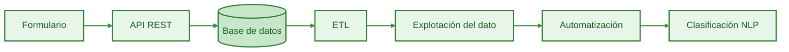
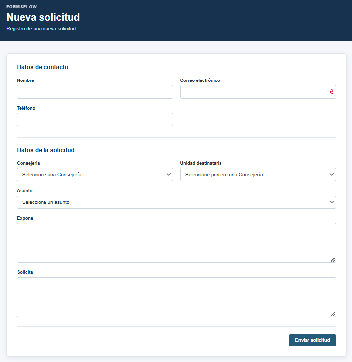
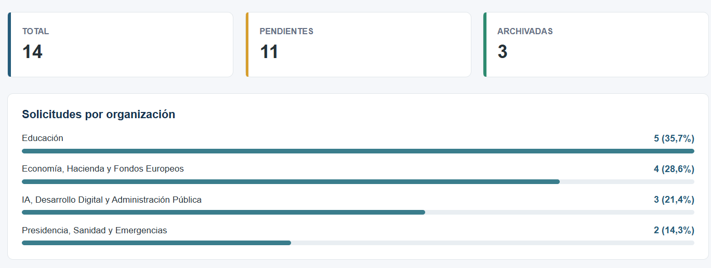
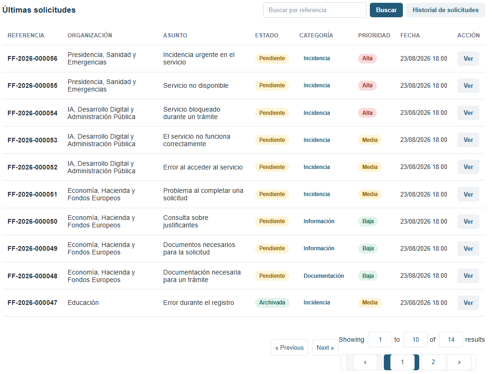
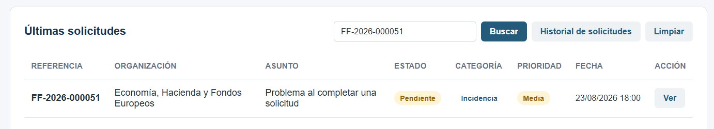
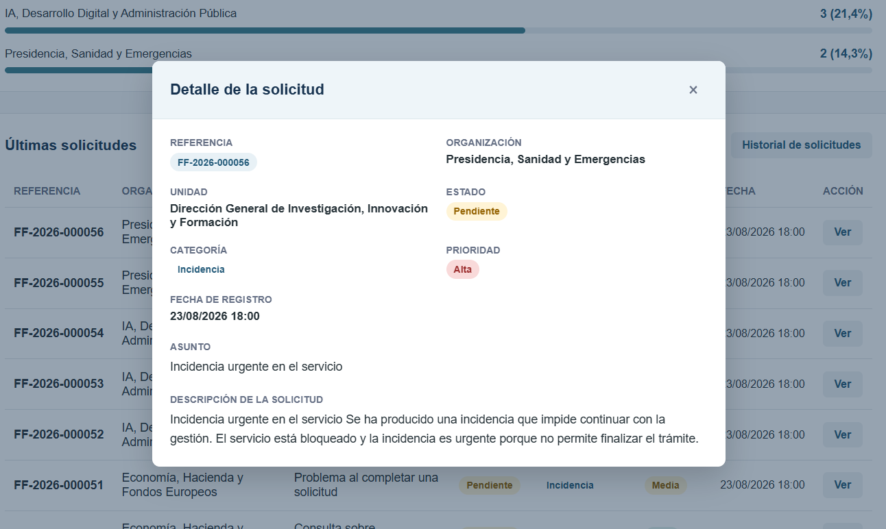
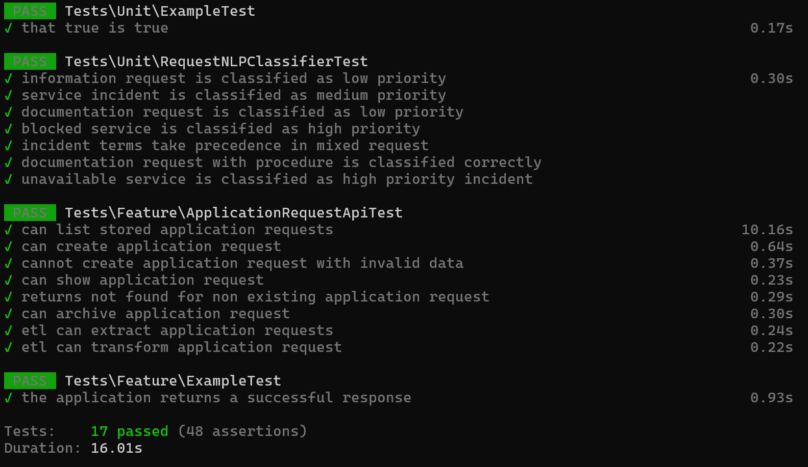
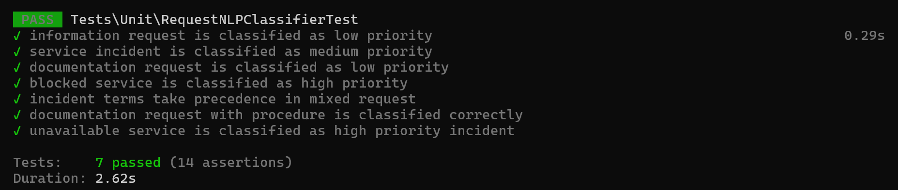

# FormsFlow

**Aplicación web full-stack para la gestión de solicitudes, integración de datos, API REST y automatización de procesos.**

FormsFlow es un proyecto full-stack desarrollado con Laravel que reproduce, a pequeña escala, un flujo de trabajo de gestión digital de solicitudes:



El proyecto está planteado como un demostrador técnico de desarrollo de soluciones digitales, integración, gestión de datos, automatización y aplicación de técnicas de PLN.

---

## Índice

- [Descripción](#descripción)
- [Objetivos](#objetivos)
- [Caso de uso](#caso-de-uso)
  - [Flujo funcional](#flujo-funcional)
- [Funcionalidades](#funcionalidades)
- [Modelo de datos](#modelo-de-datos)
  - [Datos principales de una solicitud](#datos-principales-de-una-solicitud)
  - [Tipos de solicitudes](#tipos-de-solicitudes)
- [Arquitectura](#arquitectura)
- [Stack tecnológico](#stack-tecnológico)
- [Flujo de datos](#flujo-de-datos)
- [API REST](#api-rest)
  - [Endpoints](#endpoints)
  - [Listar solicitudes](#listar-solicitudes)
  - [Crear una solicitud](#crear-una-solicitud)
  - [Consultar una solicitud](#consultar-una-solicitud)
  - [Archivar una solicitud](#archivar-una-solicitud)
  - [Validación](#validación)
  - [Códigos HTTP utilizados](#códigos-http-utilizados)
- [ETL y procesamiento NLP](#etl-y-procesamiento-nlp)
  - [Funcionamiento](#funcionamiento)
- [Automatización](#automatización)
- [Dashboard y explotación del dato](#dashboard-y-explotación-del-dato)
- [Testing](#testing)
  - [Resultado actual](#resultado-actual)
  - [Pruebas del clasificador NLP](#pruebas-del-clasificador-nlp)
- [Docker](#docker)
- [Instalación](#instalación)
  - [Requisitos](#requisitos)
  - [Ejecutar el proyecto](#ejecutar-el-proyecto)
- [Estructura del proyecto](#estructura-del-proyecto)
- [Decisiones técnicas](#decisiones-técnicas)
- [Mejoras futuras](#mejoras-futuras)
- [Documentación](#documentación)
- [Enlaces](#enlaces)
- [Licencia](#licencia)

---
## Descripción

FormsFlow es una **aplicación web full-stack** desarrollada con Laravel que reproduce, a pequeña escala, un **flujo de gestión digital de solicitudes**.

El proyecto integra en una misma aplicación diferentes capacidades relacionadas con el desarrollo de soluciones digitales:

- Formularios digitales y validación de datos.
- Persistencia en una base de datos relacional.
- API REST para la integración con otros sistemas.
- Procesamiento ETL de la información.
- Clasificación automática mediante técnicas sencillas de PLN.
- Automatización de procesos mediante Jobs y Laravel Scheduler.
- Explotación del dato mediante informes y un Dashboard.
- Testing automatizado.
- Contenerización mediante Docker.

FormsFlow utiliza un caso de uso ficticio inspirado en los procesos habituales de gestión de solicitudes administrativas electrónicas. No utiliza datos personales reales ni tramita solicitudes reales.

El **objetivo** no es construir una plataforma administrativa completa, sino desarrollar una pequeña aplicación que permita mostrar de forma integrada diferentes competencias de desarrollo, integración, tratamiento de datos y automatización.

---

## Objetivos

El objetivo principal de FormsFlow es demostrar el desarrollo de una solución digital completa que cubra el ciclo básico de una solicitud:

```text
Formulario
    ↓
Validación
    ↓
Persistencia
    ↓
API REST
    ↓
ETL
    ↓
Clasificación NLP
    ↓
Explotación del dato
    ↓
Automatización
```

---

## Caso de uso

FormsFlow **simula una plataforma de gestión de solicitudes** dirigidas a diferentes organismos y unidades administrativas.

El **usuario puede presentar una solicitud mediante un formulario digital** indicando sus datos de contacto, el organismo y unidad destinataria, el asunto, la exposición de la situación y la actuación solicitada. Una vez registrada, la solicitud queda almacenada en la base de datos y puede ser gestionada mediante la aplicación y su API REST.



Posteriormente, el **pipeline ETL extrae las solicitudes** almacenadas, **transforma y normaliza** su información y genera registros preparados para su explotación. 

Durante este procesamiento se aplica un **componente de PLN** basado en reglas y palabras clave ponderadas. En función del contenido de la solicitud, el clasificador asigna una ``categoría`` y una ``prioridad`` orientativa a cada de ellas. 

Los **datos procesados** se utilizan posteriormente para generar informes estadísticos y alimentar el **Dashboard** de FormsFlow.

El proyecto utiliza exclusivamente datos ficticios de demostración y no pretende reproducir un procedimiento administrativo real.

---

## Modelo de datos

FormsFlow utiliza un **modelo relacional** para separar las solicitudes recibidas de los registros generados durante su procesamiento.

La información principal se organiza alrededor de dos entidades:

- `application_requests`: almacena las solicitudes originales recibidas por la aplicación.
- `processed_requests`: almacena la información transformada y clasificada durante el proceso ETL.

Esta separación permite diferenciar entre los **datos de entrada** y los **datos preparados** para su explotación.

### Datos principales de una solicitud

Una solicitud contiene información relacionada con:


Solicitud
│
├── Identificación
│   └── Referencia
│
├── Persona solicitante
│   ├── Nombre
│   └── Datos de contacto
│
├── Destino
│   ├── Organización
│   └── Unidad
│
├── Contenido
│   ├── Asunto
│   ├── Exposición
│   └── Texto de la solicitud
│
├── Gestión
│   └── Estado
│
├── Clasificación
│   ├── Categoría
│   └── Prioridad
│
└── Fechas
    ├── Creación
    └── Procesamiento


Los datos de clasificación (`category` y `priority`) se generan durante el procesamiento y permiten utilizar posteriormente la información para consultas, estadísticas e informes.

### Tipos de solicitudes

El componente de PLN clasifica las solicitudes en tres categorías principales:

- `informacion`: consultas o solicitudes de información.
- `incidencia`: problemas o errores relacionados con un servicio o procedimiento.
- `documentacion`: solicitudes relacionadas con documentos, certificados o justificantes.

La prioridad se clasifica en tres niveles:

- `baja`
- `media`
- `alta`

La clasificación se realiza mediante un sistema de reglas y términos ponderados implementado en el servicio `RequestNLPClassifier`.

---

## Arquitectura

FormsFlow sigue una **arquitectura basada en Laravel** en la que los diferentes componentes de la aplicación se organizan según su responsabilidad.

```text
┌──────────────────────────────┐
│          Usuario             │
└──────────────┬───────────────┘
               │
               ▼
┌──────────────────────────────┐
│       Formularios / Blade     │
└──────────────┬───────────────┘
               │
               ▼
┌──────────────────────────────┐
│        Controllers            │
│   Web / API REST / Dashboard  │
└──────────────┬───────────────┘
               │
               ▼
┌──────────────────────────────┐
│          Eloquent             │
│      Modelos y ORM            │
└──────────────┬───────────────┘
               │
               ▼
┌──────────────────────────────┐
│       Base de datos           │
└──────────────────────────────┘

               │
               │ ETL
               ▼

┌──────────────────────────────┐
│      RequestETLService        │
│ Extract → Transform → Load    │
└──────────────┬───────────────┘
               │
               ├───────────────► RequestNLPClassifier
               │                       │
               │                       ▼
               │                 Categoría / Prioridad
               │
               ▼
┌──────────────────────────────┐
│      ProcessedRequest        │
└──────────────┬───────────────┘
               │
               ├───────────────► Informes
               │
               └───────────────► Dashboard
```

La aplicación utiliza Laravel como núcleo de la solución y separa las responsabilidades principales entre:

- controladores
- modelos
- servicios
- comandos Artisan
- vistas
- pruebas.

El procesamiento ETL se encapsula en `RequestETLService`, mientras que la clasificación de las solicitudes se concentra en `RequestNLPClassifier`.

Esta separación permite mantener aislada la lógica de negocio y facilita su prueba mediante tests unitarios y de integración.

---

## Stack tecnológico

### Backend

* **PHP**
* **Laravel**
* **Eloquent ORM**
* **Artisan**

Laravel proporciona la estructura principal de la aplicación, incluyendo routing, controladores, validación, ORM, comandos de consola, Jobs y Scheduler.

### Frontend

* **Blade**
* **HTML**
* **CSS / SCSS**
* **JavaScript**
* **Vite**

Blade se utiliza para construir las interfaces de la aplicación y Vite para gestionar y generar los recursos frontend para desarrollo y producción.

### Base de datos

FormsFlow utiliza una base de datos relacional gestionada mediante las migraciones y modelos de Laravel.

El acceso a los datos se realiza mediante Eloquent y consultas SQL cuando resulta necesario realizar operaciones agregadas o específicas.

### API

La aplicación dispone de una API REST para la gestión de solicitudes.

La API permite, entre otras operaciones:

* Consultar solicitudes.
* Crear solicitudes.
* Consultar una solicitud concreta.
* Archivar solicitudes.

Las operaciones están validadas y disponen de pruebas funcionales automatizadas en `tests/Feature/ApplicationRequestApiTest.php`. La estrategia de testing y el resultado de las pruebas se describen en la sección [Testing](#testing).

### Procesamiento de datos

El procesamiento se realiza mediante un pipeline ETL implementado dentro de Laravel:

```text
Extract
   ↓
Transform
   ↓
Load
```

Durante la transformación se normaliza la información y se aplica el clasificador NLP.

### PLN

El componente de PLN está implementado actualmente como un servicio PHP:

```text
App\Services\RequestNLPClassifier
```

El sistema **normaliza el texto** y utiliza términos ponderados para determinar la categoría y prioridad de una solicitud.

No se utiliza actualmente un modelo de aprendizaje automático entrenado. El enfoque se ha elegido por su sencillez, trazabilidad y adecuación al alcance del proyecto demostrador.

### Testing

El proyecto utiliza:

* **PHPUnit / Laravel Testing**
* **Tests unitarios**
* **Tests funcionales de API**

Actualmente la suite contiene:

```text
17 tests
48 assertions
```

---

### Contenedores y desarrollo

El entorno de desarrollo utiliza:

* **Docker**
* **Docker Compose**
* **Composer**
* **npm**
* **Vite**

El objetivo de Docker es proporcionar un entorno reproducible para ejecutar la aplicación y sus servicios asociados.

---

## ETL y procesamiento NLP

FormsFlow incorpora un **pipeline ETL** para transformar las solicitudes almacenadas en la aplicación en registros preparados para su explotación.

El proceso se implementa mediante el servicio:

```text
App\Services\RequestETLService
```

y se ejecuta mediante el comando Artisan:

```bash
php artisan etl:process
```

El pipeline sigue tres etapas:

```text
Extract
   ↓
Transform
   ↓
Load
```

### Funcionamiento

#### Extract

La primera etapa obtiene las solicitudes almacenadas en `application_requests`.

```text
application_requests
        ↓
      Extract
```

El proceso trabaja con los registros existentes y los prepara para su transformación.

#### Transform

Durante la transformación se **combinan y normalizan los datos** necesarios para generar el registro procesado. El texto utilizado para la clasificación se normaliza antes de ser enviado al componente NLP.

La normalización incluye:

* Conversión a minúsculas.
* Normalización de caracteres.
* Eliminación de diferencias producidas por las tildes.
* Normalización de espacios.

Posteriormente se ejecuta:

```text
RequestNLPClassifier
        ↓
category
priority
```

El resultado de la transformación contiene la información necesaria para crear el registro correspondiente en `processed_requests`.

#### Load

La tercera etapa almacena el resultado del procesamiento en `processed_requests`.

De esta forma se mantiene separada la información original de la información transformada y enriquecida.

```text
ApplicationRequest
       ↓
     Extract
       ↓
    Transform
       ↓
      NLP
       ↓
      Load
       ↓
ProcessedRequest
```

### Clasificación NLP

FormsFlow incorpora un **componente de procesamiento de lenguaje natural** orientado a la **clasificación de solicitudes**.

El servicio responsable es:

```text
App\Services\RequestNLPClassifier
```

El clasificador utiliza un conjunto de términos ponderados para calcular una puntuación para cada categoría y nivel de prioridad.

Las categorías disponibles son:

* `informacion`
* `incidencia`
* `documentacion`

Las prioridades disponibles son:

* `baja`
* `media`
* `alta`

El sistema también contempla la normalización de textos con caracteres acentuados.

Por ejemplo, un texto como:

```text
El servicio no está disponible.
```

se normaliza antes de realizar la comparación de términos:

```text
El servicio no está disponible.
              ↓
el servicio no esta disponible.
```

La normalización convierte el texto a minúsculas, elimina las diferencias entre caracteres acentuados y no acentuados y normaliza los espacios.

Esto permite que los términos definidos por el clasificador puedan coincidir independientemente de que el texto original contenga mayúsculas o tildes.

La clasificación de prioridad utiliza términos asociados a diferentes niveles de gravedad. Algunos **indicadores de prioridad alta** son:

* servicio no disponible;
* servicio bloqueado;
* urgente;
* ningún usuario puede utilizar el servicio.

Los indicadores de incidencia general permiten identificar problemas de prioridad media.

El sistema utiliza reglas explícitas y trazables, por lo que el resultado puede analizarse y explicarse a partir de los términos que han contribuido a la clasificación.

**No se utiliza actualmente un modelo de aprendizaje automático entrenado**. El enfoque basado en reglas se ha elegido para mantener el componente NLP pequeño, determinista y fácilmente verificable dentro del alcance del proyecto.

---

## Automatización

FormsFlow utiliza **mecanismos de automatización** proporcionados por Laravel para **ejecutar procesos** de forma programada y desacoplar determinadas tareas del flujo principal de la aplicación.

El procesamiento ETL se encapsula en un comando Artisan:

```bash
php artisan etl:process
```

El comando utiliza `RequestETLService` para:

1. Extraer las solicitudes.
2. Transformar la información.
3. Aplicar la clasificación NLP.
4. Cargar los registros procesados.

El comando muestra al finalizar el número de solicitudes procesadas.

Ejemplo:

```text
Processed 14 application requests.
```

La arquitectura permite ejecutar este proceso manualmente durante el desarrollo o integrarlo con el sistema de planificación de Laravel para automatizar su ejecución.

La **automatización** se mantiene **separada de la lógica de transformación**, de manera que el comando Artisan actúa como punto de entrada del proceso y `RequestETLService` contiene la lógica principal.

---

## Dashboard y explotación del dato

El Dashboard proporciona una interfaz para consultar y explotar la información almacenada en `processed_requests`.


Entre las funcionalidades disponibles se encuentran:

* Consulta de solicitudes procesadas.
* Búsqueda por referencia.
* Visualización de categoría.
* Visualización de prioridad.
* Visualización del estado.
* Visualización de la fecha de procesamiento.
* Paginación.
* Estadísticas agrupadas por organización.
* Porcentaje de solicitudes por organización.
* Consulta del detalle de una solicitud.


### Paginación

El Dashboard muestra las solicitudes procesadas más recientes con paginación. El sistema mantiene un **máximo de 20 solicitudes** recientes disponibles en la consulta y utiliza 10 solicitudes por página.

La paginación se realiza en el servidor. Esto evita cargar innecesariamente todos los registros en una única página y permite mantener una interfaz sencilla aunque el número de solicitudes aumente. La consulta utiliza la paginación proporcionada por Laravel.

### Búsqueda

El Dashboard permite buscar solicitudes mediante su referencia. Para realizar una búsqueda, el usuario introduce **parte o la totalidad de la referencia** en el campo de búsqueda y pulsa el botón de búsqueda.

Por ejemplo:

```text
Referencia: FF-2026-000023
```



La aplicación busca coincidencias en el campo `reference_code`.

También es posible introducir únicamente una parte de la referencia:

```text
Referencia: 000023
```

La búsqueda devuelve las solicitudes cuya referencia contiene el texto introducido.

La búsqueda se realiza sobre `reference_code` y mantiene los parámetros de consulta al navegar entre las páginas mediante `withQueryString()`.

La búsqueda se aplica mediante una consulta `LIKE`:

```php
$query->where(
    'reference_code',
    'like',
    '%'.$reference.'%'
);
```

Esto permite realizar búsquedas parciales sin necesidad de introducir la referencia completa.

### Estadísticas por organización

Las solicitudes procesadas se agrupan por organización para obtener una visión resumida de la distribución de solicitudes.

El porcentaje se calcula respecto al **total de solicitudes procesadas**, no respecto a las solicitudes que aparecen en la página actual.

La representación visual utiliza barras proporcionales para facilitar la comparación entre organizaciones.

Por ejemplo:

```text
Educación                              5 (35,7%)
████████████████████████████████████████

Economía, Hacienda y Fondos Europeos  4 (28,6%)
██████████████████████████████

IA, Desarrollo Digital...              3 (21,4%)
██████████████████████

Presidencia, Sanidad y Emergencias     2 (14,3%)
██████████████
```

La información estadística se obtiene a partir de los registros procesados, por lo que **puede actualizarse automáticamente** cuando se incorporan nuevas solicitudes.

### Estados de las solicitudes

Las solicitudes pueden encontrarse en diferentes estados dentro del flujo de gestión.

Los datos de demostración utilizan actualmente:

* `pending`: solicitud pendiente de gestión.
* `archived`: solicitud archivada.

En el conjunto actual de demostración existen:

```text
10 solicitudes pendientes
4 solicitudes archivadas
```

### Consulta del detalle

Cada solicitud mostrada en el Dashboard dispone de un botón **Ver**.

De esta forma, el usuario puede consultar el contenido completo de una solicitud desde el listado sin tener que navegar a una página diferente.

Al pulsar este botón se abre un modal con el detalle de la solicitud seleccionada, sin necesidad de abandonar la página principal.



El modal permite consultar de forma agrupada la información de la solicitud, incluyendo:

- Referencia.
- Organización.
- Unidad.
- Estado.
- Categoría.
- Prioridad.
- Fecha de registro.
- Asunto.
- Descripción de la solicitud.

El detalle de la solicitud incluye un campo de *Descripción de la solicitud* que **no corresponde directamente a un único campo del formulario**.

Esta descripción se construye **agrupando tres elementos** introducidos por el usuario:

```text
Descripción de la solicitud
│
├── Exposición de la solicitud
├── Actuación solicitada
└── Texto de la solicitud
```

De esta forma, el modal presenta el contenido de la solicitud de **manera unificada**, aunque la información se haya introducido originalmente en diferentes campos del formulario.

Esta composición se realiza únicamente para **facilitar la consulta y presentación de la información**, manteniendo los campos originales almacenados de forma independiente en la base de datos.

### Clasificación y explotación

La categoría y prioridad generadas por el componente NLP se almacenan junto al registro procesado.

Esto permite realizar consultas agregadas como:

```text
Categoría             Prioridad       Total
------------------------------------------------
documentacion         baja              1
incidencia            alta              3
incidencia            media             4
informacion           baja              6
```

De esta forma, el resultado del procesamiento automático **puede utilizarse posteriormente para generar indicadores** y facilitar la consulta de la información.

## Testing

FormsFlow **incorpora pruebas automatizadas** para validar tanto la lógica de clasificación como diferentes operaciones de la API y del procesamiento ETL.

La estrategia de pruebas se divide principalmente en:

- Tests unitarios.
- Tests funcionales de API.
- Tests de los procesos de extracción y transformación.

Las pruebas se ejecutan mediante el sistema de testing integrado en Laravel.

Para ejecutar la suite completa:

```bash
docker compose exec app php artisan test
```



La ejecución de la suite completa mediante Artisan muestra el resultado de las pruebas automatizadas y permite comprobar que todos los tests se ejecutan correctamente.

Además, se utiliza **Laravel Pint** para comprobar el cumplimiento de las **reglas de estilo** del proyecto:

```bash
docker compose exec app ./vendor/bin/pint --test

```


También puede comprobarse que no existen errores relacionados con espacios en blanco o finales de línea mediante:

```bash
git diff --check
```
### Pruebas del clasificador NLP

El clasificador `RequestNLPClassifier` dispone de **pruebas unitarias específicas**.

Actualmente se comprueban diferentes escenarios:

* Solicitud de información → prioridad baja.
* Incidencia de servicio → prioridad media.
* Solicitud de documentación → prioridad baja.
* Servicio bloqueado → prioridad alta.
* Solicitud con términos de información e incidencia → prevalencia de la incidencia.
* Solicitud de documentación relacionada con un procedimiento.
* Servicio no disponible y urgente → incidencia de prioridad alta.

Estas pruebas permiten comprobar tanto la clasificación de la categoría como la asignación de prioridad.

Para ejecutar únicamente estas pruebas:

```bash
docker compose exec app php artisan test --filter=RequestNLPClassifierTest
```



### Pruebas de la API

La API REST dispone de pruebas funcionales que cubren:

* Listado de solicitudes.
* Creación de solicitudes.
* Validación de datos incorrectos.
* Consulta de una solicitud existente.
* Respuesta cuando una solicitud no existe.
* Archivado de solicitudes.
* Extracción de datos mediante el ETL.
* Transformación de datos mediante el ETL.

Esto permite comprobar el funcionamiento de las diferentes capas principales de la aplicación.


---

## Docker

FormsFlow utiliza Docker para proporcionar un entorno de desarrollo reproducible.

Docker Compose permite **levantar los servicios necesarios** para ejecutar la aplicación sin depender de una configuración manual específica del sistema operativo.

Los principales comandos utilizados durante el desarrollo son:

```bash
docker compose up -d
```

para iniciar los servicios.

Para consultar el estado:

```bash
docker compose ps
```

Para acceder al contenedor de la aplicación:

```bash
docker compose exec app bash
```

Para ejecutar comandos Artisan:

```bash
docker compose exec app php artisan <comando>
```

Por ejemplo:

```bash
docker compose exec app php artisan test
```

El proyecto utiliza Docker principalmente para el entorno de ejecución de Laravel y la base de datos.

---

[ÍNDICE](#índice)
## Instalación

### Requisitos

Para ejecutar FormsFlow localmente se necesita disponer de:

* Git.
* Docker.
* Docker Compose.
* Node.js y npm.
* Composer, si se realizan tareas de instalación o desarrollo fuera del contenedor.

Se recomienda utilizar versiones compatibles con las dependencias definidas en el proyecto.

### Ejecutar el proyecto

Clonar el repositorio:

```bash
git clone <URL_DEL_REPOSITORIO>
cd formsflow
```

Crear el archivo de configuración:

```bash
cp .env.example .env
```

En Windows PowerShell puede utilizarse:

```powershell
Copy-Item .env.example .env
```

Iniciar los servicios:

```bash
docker compose up -d
```

Instalar las dependencias PHP si es necesario:

```bash
docker compose exec app composer install
```

Generar la clave de aplicación:

```bash
docker compose exec app php artisan key:generate
```

Ejecutar las migraciones:

```bash
docker compose exec app php artisan migrate
```

Instalar las dependencias frontend:

```bash
npm install
```

Generar los recursos frontend para producción:

```bash
npm run build
```

La aplicación puede iniciarse entonces utilizando el entorno configurado mediante Docker Compose.

### Datos de demostración

El proyecto incluye un **Seeder** específico para **generar datos ficticios de demostración**:

```bash
docker compose exec app php artisan db:seed --class=DemoDataSeeder
```

El Seeder genera solicitudes de ejemplo con diferentes:

* Organizaciones.
* Unidades.
* Tipos de solicitud.
* Estados.
* Textos para clasificación NLP.

Después de generar los datos, el pipeline ETL puede ejecutarse mediante:

```bash
docker compose exec app php artisan etl:process
```

El comando procesa las solicitudes almacenadas y genera los correspondientes registros procesados.

> **Importante:** `DemoDataSeeder` está pensado para inicializar el conjunto de datos de demostración. No debe ejecutarse repetidamente sobre una base de datos que ya contenga esos registros si no se desea duplicarlos.

### Generación de recursos frontend

Durante el desarrollo:

```bash
npm run dev
```

Para generar los recursos optimizados para producción:

```bash
npm run build
```

El build actual de Vite genera correctamente los archivos de producción en:

```text
public/build/
```

---
## Despliegue

FormsFlow está preparado para ejecutarse mediante contenedores Docker y se plantea su despliegue público utilizando una arquitectura separada para la aplicación y la base de datos.

La aplicación Laravel se desplegará mediante Docker en **Koyeb**, mientras que la base de datos PostgreSQL se alojará en **Supabase**.

La arquitectura de despliegue será:

```text
                         GitHub
                            │
                            │ Deploy
                            ▼
                    ┌───────────────┐
                    │     Koyeb     │
                    │               │
                    │    Laravel    │
                    │    Docker     │
                    └───────┬───────┘
                            │
                            │ PostgreSQL
                            ▼
                    ┌───────────────┐
                    │   Supabase    │
                    │               │
                    │  PostgreSQL   │
                    └───────────────┘
```

### Entorno de demostración

El objetivo del despliegue es proporcionar una **demo pública de FormsFlow** que permita comprobar directamente el funcionamiento de la aplicación sin necesidad de instalar el proyecto localmente.

Supabase proporciona una base de datos PostgreSQL gestionada dentro de su plan gratuito, suficiente para el volumen reducido de datos utilizado por la demo.

La configuración definitiva del despliegue, las variables de entorno y los pasos de publicación se documentarán una vez completado y validado el despliegue.

### Acceso a la demo

**Demo pública:** pendiente de despliegue.

**Repositorio:** pendiente de añadir la URL definitiva de GitHub.

---
[ÍNDICE](#índice)
## Estructura del proyecto

La estructura principal de FormsFlow sigue la organización habitual de una aplicación Laravel:

```text
formsflow/
├── app/
│   ├── Console/
│   │   └── Commands/
│   ├── Enums/
│   ├── Http/
│   │   ├── Controllers/
│   │   └── Requests/
│   ├── Models/
│   └── Services/
│
├── database/
│   ├── factories/
│   ├── migrations/
│   └── seeders/
│
├── resources/
│   ├── css/
│   ├── js/
│   └── views/
│
├── routes/
│   ├── api.php
│   ├── console.php
│   └── web.php
│
├── tests/
│   ├── Feature/
│   └── Unit/
│
├── public/
│   └── build/
│
├── docker/
├── docker-compose.yml
├── composer.json
├── package.json
└── README.md
```

Las principales responsabilidades son:

| Directorio             | Responsabilidad                     |
| ---------------------- | ----------------------------------- |
| `app/Http/Controllers` | Controladores web y API             |
| `app/Models`           | Modelos Eloquent                    |
| `app/Services`         | Lógica de procesamiento y servicios |
| `app/Enums`            | Valores enumerados del dominio      |
| `app/Console/Commands` | Comandos Artisan                    |
| `database/migrations`  | Estructura de la base de datos      |
| `database/seeders`     | Datos iniciales y de demostración   |
| `resources/views`      | Vistas Blade                        |
| `resources/js`         | JavaScript                          |
| `resources/css`        | Estilos                             |
| `routes`               | Rutas web, API y consola            |
| `tests/Feature`        | Pruebas funcionales                 |
| `tests/Unit`           | Pruebas unitarias                   |


## Decisiones técnicas

### Laravel como framework principal

Se ha utilizado Laravel como framework principal porque permite integrar en una misma aplicación diferentes necesidades del proyecto:

- Desarrollo web.
- Routing.
- Validación.
- Acceso a base de datos mediante Eloquent.
- API REST.
- Comandos Artisan.
- Jobs y Scheduler.
- Testing.
- Gestión de configuración.

Esto permite mantener una **arquitectura relativamente sencilla** sin introducir tecnologías adicionales innecesarias para el alcance del demostrador.

### Separación entre solicitudes recibidas y solicitudes procesadas

Se han separado los datos originales de las solicitudes (`application_requests`) de los registros generados por el procesamiento (`processed_requests`).

Esta decisión permite representar claramente el flujo:

```text
Datos de entrada
      ↓
Procesamiento
      ↓
Datos preparados para explotación
```

La separación **facilita** además el **desarrollo y prueba independiente del pipeline ETL**.

### Servicio independiente para el ETL

La lógica del proceso ETL se concentra en:

```text
App\Services\RequestETLService
```

El comando Artisan actúa como punto de entrada:

```bash
php artisan etl:process
```

De esta forma, la lógica de extracción, transformación y carga no queda mezclada directamente con el código del comando.

Esta **separación** facilita la **reutilización** y las **pruebas del proceso**.

### Servicio independiente para el NLP

La clasificación de solicitudes se concentra en:

```text
App\Services\RequestNLPClassifier
```

El clasificador es independiente del controlador y del proceso ETL.

Esto permite probar la clasificación mediante **tests unitarios sin necesidad de ejecutar todo el flujo** de la aplicación.

### NLP basado en reglas

Se ha optado inicialmente por un sistema de clasificación basado en **reglas y términos ponderados**.

Esta decisión responde principalmente al alcance del proyecto.

El sistema permite:

* Mantener el comportamiento determinista.
* Explicar por qué se ha asignado una categoría o prioridad.
* Evitar la necesidad de disponer de un dataset etiquetado.
* Mantener el proyecto autocontenido.
* Facilitar las pruebas automatizadas.

No se pretende presentar este componente como un modelo de inteligencia artificial entrenado, sino como una **aplicación sencilla de técnicas de PLN para clasificación y priorización de texto**.

### Docker desde el inicio

El entorno de desarrollo se ha basado en Docker y Docker Compose desde las primeras fases del proyecto.

Esto permite **reducir las diferencias entre entornos** y facilita que otra persona pueda reproducir la instalación siguiendo las instrucciones del README.

### Datos de demostración

FormsFlow utiliza **datos de demostración** y no contiene datos personales reales de personas solicitantes.

Las organizaciones y unidades administrativas utilizadas en los ejemplos están basadas en organismos y unidades reales, utilizando **información pública** como referencia para que el escenario resulte más realista.

Las solicitudes, nombres de personas, **datos de contacto**, asuntos y textos utilizados para probar el flujo de la aplicación son **ficticios** y han sido creados específicamente para el proyecto.

De esta forma, el proyecto combina referencias institucionales basadas en información pública con datos de solicitud completamente ficticios, evitando utilizar información personal real en la aplicación.

Los datos de demostración permiten **reproducir el flujo completo** de registro, procesamiento ETL, clasificación NLP y explotación del dato sin utilizar expedientes ni solicitudes reales.

### Alcance controlado

Se ha priorizado implementar un flujo completo y funcional frente a incorporar un gran número de funcionalidades independientes.

El proyecto busca demostrar diferentes capacidades integradas:

```text
Desarrollo web
      +
API
      +
Base de datos
      +
ETL
      +
NLP
      +
Automatización
      +
Explotación del dato
      +
Testing
```

Las funcionalidades que requieren una inversión significativa de tiempo y que no son necesarias para demostrar estos objetivos se mantienen como posibles mejoras futuras.

---

## Mejoras futuras

El proyecto se ha diseñado para poder ampliarse progresivamente. Las siguientes funcionalidades quedan fuera del alcance actual, pero podrían incorporarse en futuras iteraciones.

### Historial avanzado de solicitudes

El Dashboard dispone actualmente de búsqueda por referencia y paginación.

Como evolución futura se podría implementar un historial avanzado con filtros por:

* Rango de fechas.
* Organización.
* Unidad.
* Estado.
* Categoría.
* Prioridad.

El botón de acceso al historial ya se ha previsto visualmente en la interfaz.

### Autenticación y autorización

Una futura versión podría incorporar:

* Inicio de sesión.
* Roles de usuario.
* Permisos por organización.
* Control de acceso a las diferentes operaciones de la API.

### Exportación de información

Podría incorporarse la exportación de los datos procesados a formatos como:

* CSV.
* Excel.
* PDF.

Esto permitiría ampliar las capacidades de explotación del dato.

### NLP avanzado

El clasificador actual basado en reglas podría evolucionar hacia técnicas más avanzadas como:

* Modelos supervisados.
* Embeddings.
* Clasificación mediante modelos de lenguaje.
* Sistemas híbridos de reglas y modelos estadísticos.

La evolución requeriría disponer de un conjunto de datos etiquetado y definir métricas para evaluar el rendimiento del modelo.

### Dashboard avanzado

El Dashboard podría ampliarse con:

* Evolución temporal de solicitudes.
* Gráficos por categoría.
* Gráficos por prioridad.
* Distribución por unidades.
* Indicadores adicionales.
* Filtros combinados.

### Automatización avanzada

El pipeline ETL puede integrarse con una planificación periódica mediante Laravel Scheduler y evolucionar hacia procesos de automatización más completos.

También podría incorporarse un sistema de notificaciones para determinadas solicitudes de alta prioridad.

---

## Documentación

La documentación del proyecto se encuentra principalmente en este README.

Además, el código incorpora comentarios y documentación PHPDoc en las partes donde resulta útil para explicar responsabilidades y decisiones.

La documentación se organiza alrededor de:

* Arquitectura.
* Modelo de datos.
* API REST.
* Pipeline ETL.
* Clasificación NLP.
* Automatización.
* Testing.
* Instalación.
* Decisiones técnicas.
* Mejoras futuras.

El objetivo es que una persona técnica pueda comprender la arquitectura y ejecutar el proyecto sin depender de explicaciones externas.

---

## Enlaces

### Repositorio

> Pendiente de añadir la URL definitiva del repositorio público de GitHub.

### Demo

> Pendiente de añadir la URL de la demo pública.

Una vez desplegada la aplicación, ambas direcciones se incorporarán a esta sección y podrán utilizarse directamente desde el CV.

---

## Licencia

