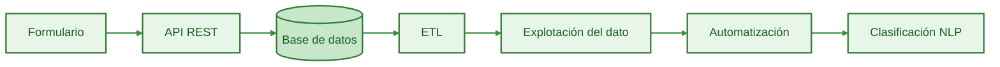
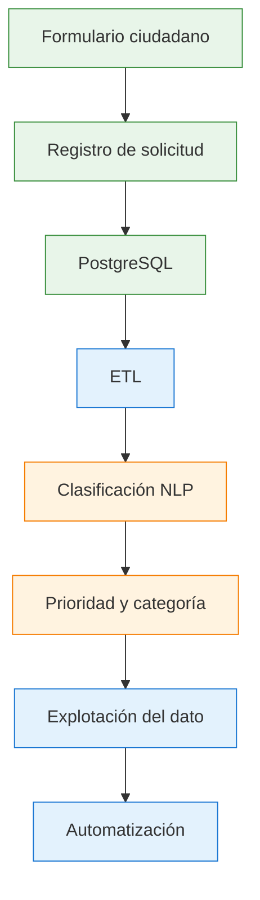
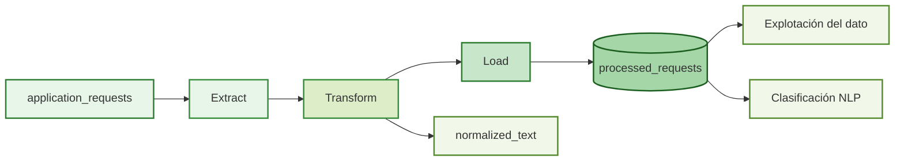
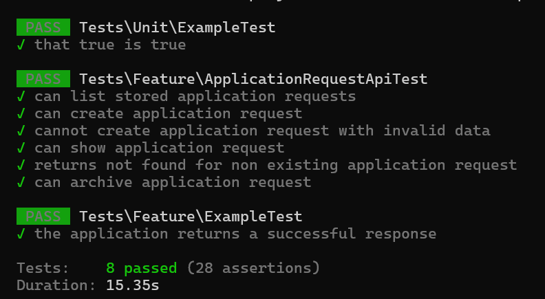

# FormsFlow

**Aplicación web full-stack para la gestión de solicitudes, integración de datos, API REST y automatización de procesos.**

FormsFlow es un proyecto full-stack desarrollado con Laravel que reproduce, a pequeña escala, un flujo de trabajo de gestión digital de solicitudes:



El proyecto está planteado como un demostrador técnico de desarrollo de soluciones digitales, integración, gestión de datos, automatización y aplicación de técnicas de PLN.

---

## Índice

- [Objetivo](#objetivo)

- [Caso de uso](#caso-de-uso)
  - [Flujo funcional](#flujo-funcional)

- [Modelo de datos](#modelo-de-datos)
  - [Datos principales de una solicitud](#datos-principales-de-una-solicitud)
  - [Tipos de solicitudes](#tipos-de-solicitudes)

- [Arquitectura](#arquitectura)

- [Stack tecnológico](#stack-tecnológico)

- [API REST](#api-rest)
  - [Endpoints](#endpoints)
  - [Listar solicitudes](#listar-solicitudes)
  - [Crear una solicitud](#crear-una-solicitud)
  - [Consultar una solicitud](#consultar-una-solicitud)
  - [Archivar una solicitud](#archivar-una-solicitud)
  - [Validación](#validación)
  - [Códigos HTTP utilizados](#códigos-http-utilizados)

- [Pipeline ETL](#pipeline-etl)
  - [Funcionamiento](#funcionamiento)

- [Testing](#testing)
  - [Resultado actual](#resultado-actual)

- [Instalación](#instalación)
  - [Requisitos](#requisitos)
  - [Ejecutar el proyecto](#ejecutar-el-proyecto)

- [Documentación](#documentación)

- [Enlaces](#enlaces)

- [Licencia](#licencia)

---

## Objetivo

**Construir una aplicación web completa que simule el ciclo de gestión de una solicitud administrativa digital**, desde su presentación mediante formulario hasta su almacenamiento, procesamiento, clasificación y explotación del dato.

El proyecto permite demostrar progresivamente:

* Desarrollo de aplicaciones web con Laravel.
* Diseño y gestión de bases de datos relacionales.
* Desarrollo y consumo de APIs REST.
* Diseño de formularios digitales y validación de datos.
* Procesos ETL.
* Automatización de tareas.
* Explotación y visualización de datos.
* Aplicación de técnicas de PLN para clasificación.
* Testing.
* Contenerización con Docker.
* Integración continua.
* Documentación técnica.

La inteligencia artificial/PLN será un **componente auxiliar del sistema**, no el objetivo principal de la aplicación.

---

## Caso de uso

FormsFlow simula una plataforma de gestión de solicitudes dirigidas a un organismo público.

El ciudadano puede presentar una solicitud mediante un formulario digital, indicando sus datos de contacto, el organismo destinatario, el asunto, una descripción de la situación (`Expone`) y la actuación que solicita (`Solicita`).

La aplicación registra y gestiona estas solicitudes y, posteriormente, permitirá procesar los datos mediante procesos ETL y aplicar un componente de PLN para clasificar automáticamente las solicitudes y establecer una prioridad orientativa.

El proyecto utiliza un **caso de uso ficticio**, inspirado en los patrones habituales de los formularios administrativos electrónicos, sin utilizar datos personales reales ni tramitar solicitudes reales.

### Flujo funcional



## Modelo de datos

La entidad principal del sistema es `ApplicationRequest`, que representa una solicitud administrativa presentada mediante el formulario digital.

La solicitud contiene:

* Datos del solicitante.
* Organismo y unidad destinataria.
* Asunto.
* Exposición (`Expone`).
* Petición (`Solicita`).
* Estado de tramitación.
* Categoría.
* Prioridad.

La categoría y la prioridad se incorporarán posteriormente mediante el procesamiento automático del sistema.

### Datos principales de una solicitud

```text
ApplicationRequest
├── Datos del solicitante
├── Destino
├── Asunto
├── Expone
├── Solicita
├── Estado
├── Categoría
└── Prioridad
```

### Tipos de solicitudes

El sistema está preparado para trabajar posteriormente con diferentes categorías, como:

* Información → consultas sobre servicios o procedimientos.
* Incidencia → comunicación de un problema en un servicio.
* Documentación → solicitudes relacionadas con documentos o certificados.

---

## Arquitectura

La aplicación se desarrolla sobre una arquitectura basada en contenedores:

```text
┌───────────────────────────────┐
│          FormsFlow            │
│                               │
│  ┌─────────────────────────┐  │
│  │       Laravel 12        │  │
│  │        PHP 8.3          │  │
│  └────────────┬────────────┘  │
│               │               │
│               ▼               │
│  ┌─────────────────────────┐  │
│  │      PostgreSQL 16      │  │
│  └─────────────────────────┘  │
│                               │
└───────────────────────────────┘
```

El componente de PLN se incorporará posteriormente como un servicio independiente.

---

## Stack tecnológico

| Tecnología     | Uso                         |
| -------------- | --------------------------- |
| Laravel 12     | Backend y aplicación web    |
| PHP 8.3        | Lenguaje de backend         |
| PostgreSQL 16  | Base de datos               |
| Docker         | Contenerización             |
| Docker Compose | Orquestación local          |
| Composer       | Gestión de dependencias PHP |
| PHPUnit        | Testing                     |
| Git / GitHub   | Control de versiones        |
| GitHub Actions | Integración continua        |
| Python         | Componente NLP              |
| FastAPI        | API del servicio NLP        |
| scikit-learn   | Clasificación de texto      |

> Los componentes que todavía no se han implementado se incorporarán progresivamente durante el desarrollo.

---

[ÍNDICE](#índice)
# API REST

FormsFlow dispone de una API REST para consultar, crear y gestionar solicitudes.

## Endpoints

| Método  | Endpoint                                 | Descripción                                                     | Respuesta     |
| ------- | ---------------------------------------- | --------------------------------------------------------------- | ------------- |
| `GET`   | `/api/requests`                          | Obtiene un listado resumido de solicitudes                      | `200 OK`      |
| `POST`  | `/api/requests`                          | Crea una nueva solicitud                                        | `201 Created` |
| `GET`   | `/api/requests/{reference_code}`         | Obtiene una solicitud completa mediante su código de referencia | `200 OK`      |
| `PATCH` | `/api/requests/{reference_code}/archive` | Archiva una solicitud                                           | `200 OK`      |

---

## Listar solicitudes

```http
GET /api/requests
Accept: application/json
```

La respuesta contiene un listado resumido de las solicitudes:

```json
{
    "data": [
        {
            "reference_code": "FF-2026-000010",
            "organization": "Educación",
            "unit": "Dirección General de Innovación y Formación del Profesorado",
            "subject": "Problema con un servicio",
            "status": "pending",
            "category": null,
            "priority": null,
            "created_at": "2026-08-20T09:48:27.000000Z"
        }
    ]
}
```

El listado utiliza una selección reducida de campos y no incluye los datos personales ni el contenido completo de la solicitud.

---

## Crear una solicitud

```http
POST /api/requests
Content-Type: application/json
Accept: application/json
```

Ejemplo de petición:

```json
{
    "name": "Carlos López",
    "email": "carlos.lopez@example.com",
    "phone": "600987654",
    "organization": "Educación",
    "unit": "Dirección General de Innovación y Formación del Profesorado",
    "subject": "Problema con un servicio",
    "statement": "No puedo acceder correctamente al servicio.",
    "request_text": "Solicito que se revise el problema."
}
```

Respuesta:

```json
{
    "message": "Solicitud creada correctamente.",
    "data": {
        "reference_code": "FF-2026-000010",
        "status": "pending",
        "created_at": "2026-08-20T09:48:27.000000Z"
    }
}
```

La aplicación genera automáticamente el `reference_code` y asigna inicialmente el estado `pending`.

---

## Consultar una solicitud

```http
GET /api/requests/FF-2026-000010
Accept: application/json
```

La respuesta contiene la información completa de la solicitud:

```json
{
    "data": {
        "id": 10,
        "reference_code": "FF-2026-000010",
        "name": "Carlos López",
        "email": "carlos.lopez@example.com",
        "phone": "600987654",
        "organization": "Educación",
        "unit": "Dirección General de Innovación y Formación del Profesorado",
        "subject": "Problema con un servicio",
        "statement": "No puedo acceder correctamente al servicio.",
        "request_text": "Solicito que se revise el problema.",
        "status": "pending",
        "category": null,
        "priority": null,
        "created_at": "2026-08-20T09:48:27.000000Z",
        "updated_at": "2026-08-20T09:48:27.000000Z"
    }
}
```

Si el código de referencia no existe, la API devuelve:

```text
404 Not Found
```

---

## Archivar una solicitud

```http
PATCH /api/requests/FF-2026-000010/archive
Accept: application/json
```

Respuesta:

```json
{
    "message": "Solicitud archivada correctamente.",
    "data": {
        "reference_code": "FF-2026-000010",
        "status": "archived"
    }
}
```

La operación modifica el estado de la solicitud de `pending` a `archived` y persiste el cambio en PostgreSQL.

---

## Validación

Las solicitudes de creación se validan mediante `StoreApplicationRequest`.

Los campos obligatorios y las reglas de validación están centralizados en este `Form Request`.

Si faltan campos obligatorios o los datos no cumplen las reglas establecidas, la API devuelve:

```text
422 Unprocessable Content
```

junto con los errores de validación correspondientes.

---

## Códigos HTTP utilizados

| Código | Significado                       |
| ------ | --------------------------------- |
| `200`  | Operación realizada correctamente |
| `201`  | Solicitud creada correctamente    |
| `404`  | Solicitud no encontrada           |
| `422`  | Datos de entrada no válidos       |

---

## Pipeline ETL

FormsFlow incorpora un pipeline ETL que permite transformar las solicitudes almacenadas en `application_requests` en registros preparados para su explotación y posterior clasificación mediante NLP.



### Funcionamiento

**Extract**

- El proceso obtiene las solicitudes almacenadas en `application_requests` mediante `RequestETLService`.

**Transform**

- Los datos se limpian y normalizan. 

- Los campos `subject`, `statement` y `request_text` se combinan para generar `normalized_text`, que servirá como base para el procesamiento posterior.

**Load**

- Los datos transformados se almacenan en `processed_requests`. 

- El proceso utiliza `reference_code` como identificador único y `updateOrCreate()` para evitar registros duplicados cuando el pipeline se ejecuta nuevamente.

El pipeline puede ejecutarse mediante el comando Artisan:

```bash
docker compose exec app php artisan etl:process
```

---
[ÍNDICE](#índice)
## Testing

El proyecto utiliza PHPUnit para realizar pruebas automatizadas de la aplicación y de la API REST.

Los tests se ejecutan sobre una base de datos PostgreSQL independiente de la utilizada durante el desarrollo: ``formsflow_testing``

Esto **permite mantener aislados los datos** generados durante las pruebas y **evitar que las ejecuciones** de PHPUnit **modifiquen la base de datos** de desarrollo.

El entorno de testing está configurado en `phpunit.xml` y utiliza el mismo motor PostgreSQL que la aplicación. De esta forma, las pruebas también cubren características específicas de PostgreSQL utilizadas por el proyecto, como la `SEQUENCE` empleada para generar automáticamente los códigos de referencia de las solicitudes.

### Ejecución de los tests

Los tests se ejecutan dentro del contenedor Docker mediante:

```bash
docker compose exec app php artisan test
```

### Resultado actual

La batería de pruebas actual se ejecuta correctamente:

- **8 tests**
- **28 assertions**
- **0 errores**



*Figura 2. Ejecución de la suite de pruebas automatizadas.*

La suite incluye pruebas de:

- Listado de solicitudes mediante API REST.
- Creación de solicitudes.
- Validación de datos de entrada.
- Consulta de solicitudes mediante código de referencia.
- Respuesta `404` para solicitudes inexistentes.
- Archivado de solicitudes.
- Persistencia de los cambios en PostgreSQL.
- Generación y utilización del código de referencia.

La estrategia de testing se ampliará progresivamente a medida que se incorporen nuevas funcionalidades al proyecto.

---

## Instalación

### Requisitos

* Docker Desktop
* Git

No es necesario instalar PHP, Composer o PostgreSQL directamente en el equipo, ya que forman parte del entorno Docker.

### Ejecutar el proyecto

Clonar el repositorio:

```bash
git clone git@github.com:viorbe20/formsflow.git
cd formsflow
```

Crear el archivo de configuración:

```bash
cp .env.example .env
```

Arrancar los servicios:

```bash
docker compose up -d
```

Ejecutar las migraciones:

```bash
docker compose exec app php artisan migrate
```

La aplicación estará disponible en:

```text
http://localhost:8000
```

---

## Documentación

Incluye:

* Arquitectura.
* Modelo de datos.
* API REST.
* Procesos ETL.
* Automatizaciones.
* Componente NLP.
* Decisiones técnicas.
* Testing.
* Despliegue.


---

## Enlaces

**Repositorio:**

[https://github.com/viorbe20/formsflow](https://github.com/viorbe20/formsflow)

**Demo pública:**

*Pendiente de despliegue.*

---

##  Licencia

Proyecto demostrador desarrollado con fines de portfolio y acreditación de competencias técnicas.
